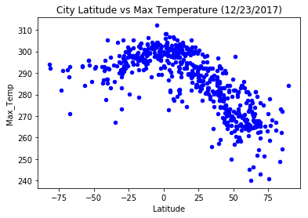
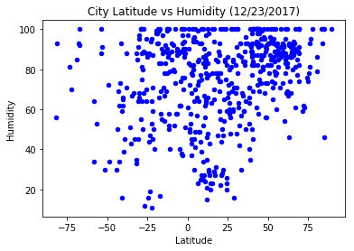
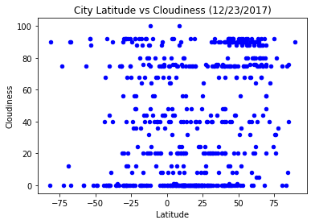
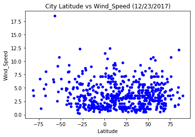

Observations :
1.For the randomly chosen cities, The maximum temperature is the highest around the values of latitude being close to '0'
2.For the randomly selected cities, the wind speed is greater for cities that have latitudes in the positive range
3.For the Randomly selected cities, the higher the latitude the maximum temperatures are dipping (and vice versa which establihes an indirectly propotional ratio)

```python
# Import Dependencies 

from citipy import citipy
import numpy as np
import pandas as pd
import matplotlib.pyplot as plt
import matplotlib
import requests
import time
import json 
import random
import sys
import math
from random import uniform
import requests as req
import datetime as dt


```


```python
#randomly generatge lat and long coordinates and print them as a list of tuples 
coordinates =[]
def newpoint():
   return uniform(-90,90), uniform(-90, 90)

points = (newpoint() for x in range(1500))
for point in points:
   #print (point)
   coordinates.append(point)
    
#print(coordinates)


```


```python
# using the citipy library, pass randomly generated coordinates to get the list of cities 

cities = []
city_names=[]
latit=[]
longit=[]
for coordinate_pair in coordinates:
    lat, lon = coordinate_pair
    latit.append(lat)
    longit.append(lon)
    cities.append(citipy.nearest_city(lat, lon))
    
for city in cities:
    name = city.city_name
    city_names.append(name)
    #print(name)
    

df_temp = pd.DataFrame(
    {'City_temp': city_names,
     'Latitude_Temp': latit,
     'Longitude_Temp': longit
    })


print(df_temp.head())

city_names1=pd.unique(city_names).tolist()
print(len(city_names1))

df_temp2 = df_temp.drop_duplicates(subset=['City_temp'])
        

#print(df_temp2)


    
#print(city_names)
#print(latit)
#print(longit)


```

                  City_temp  Latitude_Temp  Longitude_Temp
    0  doctor pedro p. pena     -22.136692      -61.276073
    1               ushuaia     -73.768601      -52.046075
    2               kumluca      36.296334       30.750276
    3                 galle       4.634848       78.172620
    4               huarmey     -11.743068      -82.815312
    622


```python
# perform the API calls on the list of cities 

weather_response1=[]
cloudiness=[]
Country=[]
Date=[]
Humidity=[]
Max_Temp =[]
Wind_Speed =[]

api_key = "a283664ee6738d95e4117afe0d31a481"
url = "http://api.openweathermap.org/data/2.5/weather?"

print('Beginning of data retrieval')
print('--------------------------------------')
row=1

for City in df_temp2['City_temp']:
    target_url = "http://api.openweathermap.org/data/2.5/weather?q=%s&appid=%s" % (City, api_key)
    print('Processing' + str(row) +'records out of 500'+ "  " + City)
    row=row+1
    print(target_url)
    weather_response = req.get(target_url)
    try:
        cloud_data=weather_response.json()["clouds"]["all"]
        country_data=weather_response.json()["sys"]["country"]
        date_data= weather_response.json()["dt"]
        humidity_data=weather_response.json()["main"]["humidity"]
        maxtemp_data=weather_response.json()["main"]["temp_max"]
        wind_data=weather_response.json()["wind"]["speed"]
        
    except:
        cloud_data="NaN"
        country_data="NaN"
        date_data="NaN"
        humidity_data="NaN"
        maxtemp_data="NaN"
        wind_data="NaN"
        
    # adding the above data to lists     
    
  
    cloudiness.append(cloud_data)
    Country.append(country_data)
    Date.append(date_data)
    Humidity.append(humidity_data)
    Max_Temp.append(maxtemp_data)
    Wind_Speed.append(wind_data)
    
print("End of Data Retrieval")
print('------------------------------------------------------')
    
#print(weather_response1)
#print(cloudiness)
#print(Country)
#print(Date)
#print(Humidity)
#print(Max_Temp)
#print(Wind_Speed)


```

    Beginning of data retrieval
    --------------------------------------
    Processing1records out of 500  doctor pedro p. pena
    http://api.openweathermap.org/data/2.5/weather?q=doctor pedro p. pena&appid=a283664ee6738d95e4117afe0d31a481
    Processing2records out of 500  ushuaia
    http://api.openweathermap.org/data/2.5/weather?q=ushuaia&appid=a283664ee6738d95e4117afe0d31a481
    Processing3records out of 500  kumluca
    http://api.openweathermap.org/data/2.5/weather?q=kumluca&appid=a283664ee6738d95e4117afe0d31a481
    Processing4records out of 500  galle
    http://api.openweathermap.org/data/2.5/weather?q=galle&appid=a283664ee6738d95e4117afe0d31a481
    Processing5records out of 500  huarmey
    http://api.openweathermap.org/data/2.5/weather?q=huarmey&appid=a283664ee6738d95e4117afe0d31a481
    Processing6records out of 500  tasbuget
    http://api.openweathermap.org/data/2.5/weather?q=tasbuget&appid=a283664ee6738d95e4117afe0d31a481
    Processing7records out of 500  salalah
    http://api.openweathermap.org/data/2.5/weather?q=salalah&appid=a283664ee6738d95e4117afe0d31a481
    Processing8records out of 500  east london
    http://api.openweathermap.org/data/2.5/weather?q=east london&appid=a283664ee6738d95e4117afe0d31a481
    Processing9records out of 500  gunjur
    http://api.openweathermap.org/data/2.5/weather?q=gunjur&appid=a283664ee6738d95e4117afe0d31a481
    Processing10records out of 500  jamestown
    http://api.openweathermap.org/data/2.5/weather?q=jamestown&appid=a283664ee6738d95e4117afe0d31a481
    Processing11records out of 500  cap malheureux
    http://api.openweathermap.org/data/2.5/weather?q=cap malheureux&appid=a283664ee6738d95e4117afe0d31a481
    Processing12records out of 500  illoqqortoormiut
    http://api.openweathermap.org/data/2.5/weather?q=illoqqortoormiut&appid=a283664ee6738d95e4117afe0d31a481
    Processing13records out of 500  punta arenas
    http://api.openweathermap.org/data/2.5/weather?q=punta arenas&appid=a283664ee6738d95e4117afe0d31a481
    Processing14records out of 500  aksarka
    http://api.openweathermap.org/data/2.5/weather?q=aksarka&appid=a283664ee6738d95e4117afe0d31a481
    Processing15records out of 500  hermanus
    http://api.openweathermap.org/data/2.5/weather?q=hermanus&appid=a283664ee6738d95e4117afe0d31a481
    Processing16records out of 500  anloga
    http://api.openweathermap.org/data/2.5/weather?q=anloga&appid=a283664ee6738d95e4117afe0d31a481
    Processing17records out of 500  port elizabeth
    http://api.openweathermap.org/data/2.5/weather?q=port elizabeth&appid=a283664ee6738d95e4117afe0d31a481
    Processing18records out of 500  kautokeino
    http://api.openweathermap.org/data/2.5/weather?q=kautokeino&appid=a283664ee6738d95e4117afe0d31a481
    Processing19records out of 500  police
    http://api.openweathermap.org/data/2.5/weather?q=police&appid=a283664ee6738d95e4117afe0d31a481
    Processing20records out of 500  krasnoarmeysk
    http://api.openweathermap.org/data/2.5/weather?q=krasnoarmeysk&appid=a283664ee6738d95e4117afe0d31a481
    Processing21records out of 500  praia da vitoria
    http://api.openweathermap.org/data/2.5/weather?q=praia da vitoria&appid=a283664ee6738d95e4117afe0d31a481
    Processing22records out of 500  cape town
    http://api.openweathermap.org/data/2.5/weather?q=cape town&appid=a283664ee6738d95e4117afe0d31a481
    Processing23records out of 500  barentsburg
    http://api.openweathermap.org/data/2.5/weather?q=barentsburg&appid=a283664ee6738d95e4117afe0d31a481
    Processing24records out of 500  berlevag
    http://api.openweathermap.org/data/2.5/weather?q=berlevag&appid=a283664ee6738d95e4117afe0d31a481
    Processing25records out of 500  tumannyy
    http://api.openweathermap.org/data/2.5/weather?q=tumannyy&appid=a283664ee6738d95e4117afe0d31a481
    Processing26records out of 500  hithadhoo
    http://api.openweathermap.org/data/2.5/weather?q=hithadhoo&appid=a283664ee6738d95e4117afe0d31a481
    Processing27records out of 500  djibo
    http://api.openweathermap.org/data/2.5/weather?q=djibo&appid=a283664ee6738d95e4117afe0d31a481
    Processing28records out of 500  chuy
    http://api.openweathermap.org/data/2.5/weather?q=chuy&appid=a283664ee6738d95e4117afe0d31a481
    Processing29records out of 500  pisco
    http://api.openweathermap.org/data/2.5/weather?q=pisco&appid=a283664ee6738d95e4117afe0d31a481
    Processing30records out of 500  mahanje
    http://api.openweathermap.org/data/2.5/weather?q=mahanje&appid=a283664ee6738d95e4117afe0d31a481
    Processing31records out of 500  kruisfontein
    http://api.openweathermap.org/data/2.5/weather?q=kruisfontein&appid=a283664ee6738d95e4117afe0d31a481
    Processing32records out of 500  dikson
    http://api.openweathermap.org/data/2.5/weather?q=dikson&appid=a283664ee6738d95e4117afe0d31a481
    Processing33records out of 500  sao joao da barra
    http://api.openweathermap.org/data/2.5/weather?q=sao joao da barra&appid=a283664ee6738d95e4117afe0d31a481
    Processing34records out of 500  ozgon
    http://api.openweathermap.org/data/2.5/weather?q=ozgon&appid=a283664ee6738d95e4117afe0d31a481
    Processing35records out of 500  qaanaaq
    http://api.openweathermap.org/data/2.5/weather?q=qaanaaq&appid=a283664ee6738d95e4117afe0d31a481
    Processing36records out of 500  bambous virieux
    http://api.openweathermap.org/data/2.5/weather?q=bambous virieux&appid=a283664ee6738d95e4117afe0d31a481
    Processing37records out of 500  ostrovnoy
    http://api.openweathermap.org/data/2.5/weather?q=ostrovnoy&appid=a283664ee6738d95e4117afe0d31a481
    Processing38records out of 500  hof
    http://api.openweathermap.org/data/2.5/weather?q=hof&appid=a283664ee6738d95e4117afe0d31a481
    Processing39records out of 500  poltavka
    http://api.openweathermap.org/data/2.5/weather?q=poltavka&appid=a283664ee6738d95e4117afe0d31a481
    Processing40records out of 500  nanortalik
    http://api.openweathermap.org/data/2.5/weather?q=nanortalik&appid=a283664ee6738d95e4117afe0d31a481
    Processing41records out of 500  gilgit
    http://api.openweathermap.org/data/2.5/weather?q=gilgit&appid=a283664ee6738d95e4117afe0d31a481
    Processing42records out of 500  asosa
    http://api.openweathermap.org/data/2.5/weather?q=asosa&appid=a283664ee6738d95e4117afe0d31a481
    Processing43records out of 500  araouane
    http://api.openweathermap.org/data/2.5/weather?q=araouane&appid=a283664ee6738d95e4117afe0d31a481
    Processing44records out of 500  thompson
    http://api.openweathermap.org/data/2.5/weather?q=thompson&appid=a283664ee6738d95e4117afe0d31a481
    Processing45records out of 500  saldanha
    http://api.openweathermap.org/data/2.5/weather?q=saldanha&appid=a283664ee6738d95e4117afe0d31a481
    Processing46records out of 500  urucui
    http://api.openweathermap.org/data/2.5/weather?q=urucui&appid=a283664ee6738d95e4117afe0d31a481
    Processing47records out of 500  polunochnoye
    http://api.openweathermap.org/data/2.5/weather?q=polunochnoye&appid=a283664ee6738d95e4117afe0d31a481
    Processing48records out of 500  togur
    http://api.openweathermap.org/data/2.5/weather?q=togur&appid=a283664ee6738d95e4117afe0d31a481
    Processing49records out of 500  presidencia roque saenz pena
    http://api.openweathermap.org/data/2.5/weather?q=presidencia roque saenz pena&appid=a283664ee6738d95e4117afe0d31a481
    Processing50records out of 500  vila franca do campo
    http://api.openweathermap.org/data/2.5/weather?q=vila franca do campo&appid=a283664ee6738d95e4117afe0d31a481
    Processing51records out of 500  rypin
    http://api.openweathermap.org/data/2.5/weather?q=rypin&appid=a283664ee6738d95e4117afe0d31a481
    Processing52records out of 500  umzimvubu
    http://api.openweathermap.org/data/2.5/weather?q=umzimvubu&appid=a283664ee6738d95e4117afe0d31a481
    Processing53records out of 500  victoria
    http://api.openweathermap.org/data/2.5/weather?q=victoria&appid=a283664ee6738d95e4117afe0d31a481
    Processing54records out of 500  qaqortoq
    http://api.openweathermap.org/data/2.5/weather?q=qaqortoq&appid=a283664ee6738d95e4117afe0d31a481
    Processing55records out of 500  machico
    http://api.openweathermap.org/data/2.5/weather?q=machico&appid=a283664ee6738d95e4117afe0d31a481
    Processing56records out of 500  zhezkazgan
    http://api.openweathermap.org/data/2.5/weather?q=zhezkazgan&appid=a283664ee6738d95e4117afe0d31a481
    Processing57records out of 500  chatakonda
    http://api.openweathermap.org/data/2.5/weather?q=chatakonda&appid=a283664ee6738d95e4117afe0d31a481
    Processing58records out of 500  onguday
    http://api.openweathermap.org/data/2.5/weather?q=onguday&appid=a283664ee6738d95e4117afe0d31a481
    Processing59records out of 500  bongandanga
    http://api.openweathermap.org/data/2.5/weather?q=bongandanga&appid=a283664ee6738d95e4117afe0d31a481
    Processing60records out of 500  arraial do cabo
    http://api.openweathermap.org/data/2.5/weather?q=arraial do cabo&appid=a283664ee6738d95e4117afe0d31a481
    Processing61records out of 500  west bay
    http://api.openweathermap.org/data/2.5/weather?q=west bay&appid=a283664ee6738d95e4117afe0d31a481
    Processing62records out of 500  georgetown
    http://api.openweathermap.org/data/2.5/weather?q=georgetown&appid=a283664ee6738d95e4117afe0d31a481
    Processing63records out of 500  taolanaro
    http://api.openweathermap.org/data/2.5/weather?q=taolanaro&appid=a283664ee6738d95e4117afe0d31a481
    Processing64records out of 500  dingle
    http://api.openweathermap.org/data/2.5/weather?q=dingle&appid=a283664ee6738d95e4117afe0d31a481
    Processing65records out of 500  banfora
    http://api.openweathermap.org/data/2.5/weather?q=banfora&appid=a283664ee6738d95e4117afe0d31a481
    Processing66records out of 500  margate
    http://api.openweathermap.org/data/2.5/weather?q=margate&appid=a283664ee6738d95e4117afe0d31a481
    Processing67records out of 500  buqayq
    http://api.openweathermap.org/data/2.5/weather?q=buqayq&appid=a283664ee6738d95e4117afe0d31a481
    Processing68records out of 500  toliary
    http://api.openweathermap.org/data/2.5/weather?q=toliary&appid=a283664ee6738d95e4117afe0d31a481
    Processing69records out of 500  tasiilaq
    http://api.openweathermap.org/data/2.5/weather?q=tasiilaq&appid=a283664ee6738d95e4117afe0d31a481
    Processing70records out of 500  forio
    http://api.openweathermap.org/data/2.5/weather?q=forio&appid=a283664ee6738d95e4117afe0d31a481
    Processing71records out of 500  cascais
    http://api.openweathermap.org/data/2.5/weather?q=cascais&appid=a283664ee6738d95e4117afe0d31a481
    Processing72records out of 500  cabedelo
    http://api.openweathermap.org/data/2.5/weather?q=cabedelo&appid=a283664ee6738d95e4117afe0d31a481
    Processing73records out of 500  falavarjan
    http://api.openweathermap.org/data/2.5/weather?q=falavarjan&appid=a283664ee6738d95e4117afe0d31a481
    Processing74records out of 500  banda aceh
    http://api.openweathermap.org/data/2.5/weather?q=banda aceh&appid=a283664ee6738d95e4117afe0d31a481
    Processing75records out of 500  tiruchchendur
    http://api.openweathermap.org/data/2.5/weather?q=tiruchchendur&appid=a283664ee6738d95e4117afe0d31a481
    Processing76records out of 500  taoudenni
    http://api.openweathermap.org/data/2.5/weather?q=taoudenni&appid=a283664ee6738d95e4117afe0d31a481
    Processing77records out of 500  covington
    http://api.openweathermap.org/data/2.5/weather?q=covington&appid=a283664ee6738d95e4117afe0d31a481
    Processing78records out of 500  lagoa
    http://api.openweathermap.org/data/2.5/weather?q=lagoa&appid=a283664ee6738d95e4117afe0d31a481
    Processing79records out of 500  yanam
    http://api.openweathermap.org/data/2.5/weather?q=yanam&appid=a283664ee6738d95e4117afe0d31a481
    Processing80records out of 500  saint-philippe
    http://api.openweathermap.org/data/2.5/weather?q=saint-philippe&appid=a283664ee6738d95e4117afe0d31a481
    Processing81records out of 500  viedma
    http://api.openweathermap.org/data/2.5/weather?q=viedma&appid=a283664ee6738d95e4117afe0d31a481
    Processing82records out of 500  nurobod
    http://api.openweathermap.org/data/2.5/weather?q=nurobod&appid=a283664ee6738d95e4117afe0d31a481
    Processing83records out of 500  bredasdorp
    http://api.openweathermap.org/data/2.5/weather?q=bredasdorp&appid=a283664ee6738d95e4117afe0d31a481
    Processing84records out of 500  pangnirtung
    http://api.openweathermap.org/data/2.5/weather?q=pangnirtung&appid=a283664ee6738d95e4117afe0d31a481
    Processing85records out of 500  cuamba
    http://api.openweathermap.org/data/2.5/weather?q=cuamba&appid=a283664ee6738d95e4117afe0d31a481
    Processing86records out of 500  talnakh
    http://api.openweathermap.org/data/2.5/weather?q=talnakh&appid=a283664ee6738d95e4117afe0d31a481
    Processing87records out of 500  mrirt
    http://api.openweathermap.org/data/2.5/weather?q=mrirt&appid=a283664ee6738d95e4117afe0d31a481
    Processing88records out of 500  pimenta bueno
    http://api.openweathermap.org/data/2.5/weather?q=pimenta bueno&appid=a283664ee6738d95e4117afe0d31a481
    Processing89records out of 500  black river
    http://api.openweathermap.org/data/2.5/weather?q=black river&appid=a283664ee6738d95e4117afe0d31a481
    Processing90records out of 500  sohbatpur
    http://api.openweathermap.org/data/2.5/weather?q=sohbatpur&appid=a283664ee6738d95e4117afe0d31a481
    Processing91records out of 500  unye
    http://api.openweathermap.org/data/2.5/weather?q=unye&appid=a283664ee6738d95e4117afe0d31a481
    Processing92records out of 500  ribeira grande
    http://api.openweathermap.org/data/2.5/weather?q=ribeira grande&appid=a283664ee6738d95e4117afe0d31a481
    Processing93records out of 500  opobo
    http://api.openweathermap.org/data/2.5/weather?q=opobo&appid=a283664ee6738d95e4117afe0d31a481
    Processing94records out of 500  bronnoysund
    http://api.openweathermap.org/data/2.5/weather?q=bronnoysund&appid=a283664ee6738d95e4117afe0d31a481
    Processing95records out of 500  mykhaylivka
    http://api.openweathermap.org/data/2.5/weather?q=mykhaylivka&appid=a283664ee6738d95e4117afe0d31a481
    Processing96records out of 500  saint-joseph
    http://api.openweathermap.org/data/2.5/weather?q=saint-joseph&appid=a283664ee6738d95e4117afe0d31a481
    Processing97records out of 500  horizontina
    http://api.openweathermap.org/data/2.5/weather?q=horizontina&appid=a283664ee6738d95e4117afe0d31a481
    Processing98records out of 500  nicoya
    http://api.openweathermap.org/data/2.5/weather?q=nicoya&appid=a283664ee6738d95e4117afe0d31a481
    Processing99records out of 500  molochnoye
    http://api.openweathermap.org/data/2.5/weather?q=molochnoye&appid=a283664ee6738d95e4117afe0d31a481
    Processing100records out of 500  sioux lookout
    http://api.openweathermap.org/data/2.5/weather?q=sioux lookout&appid=a283664ee6738d95e4117afe0d31a481
    Processing101records out of 500  marawi
    http://api.openweathermap.org/data/2.5/weather?q=marawi&appid=a283664ee6738d95e4117afe0d31a481
    Processing102records out of 500  kotelnich
    http://api.openweathermap.org/data/2.5/weather?q=kotelnich&appid=a283664ee6738d95e4117afe0d31a481
    Processing103records out of 500  assentoft
    http://api.openweathermap.org/data/2.5/weather?q=assentoft&appid=a283664ee6738d95e4117afe0d31a481
    Processing104records out of 500  riyadh
    http://api.openweathermap.org/data/2.5/weather?q=riyadh&appid=a283664ee6738d95e4117afe0d31a481
    Processing105records out of 500  faro
    http://api.openweathermap.org/data/2.5/weather?q=faro&appid=a283664ee6738d95e4117afe0d31a481
    Processing106records out of 500  escanaba
    http://api.openweathermap.org/data/2.5/weather?q=escanaba&appid=a283664ee6738d95e4117afe0d31a481
    Processing107records out of 500  los llanos de aridane
    http://api.openweathermap.org/data/2.5/weather?q=los llanos de aridane&appid=a283664ee6738d95e4117afe0d31a481
    Processing108records out of 500  garowe
    http://api.openweathermap.org/data/2.5/weather?q=garowe&appid=a283664ee6738d95e4117afe0d31a481
    Processing109records out of 500  do gonbadan
    http://api.openweathermap.org/data/2.5/weather?q=do gonbadan&appid=a283664ee6738d95e4117afe0d31a481
    Processing110records out of 500  paamiut
    http://api.openweathermap.org/data/2.5/weather?q=paamiut&appid=a283664ee6738d95e4117afe0d31a481
    Processing111records out of 500  busselton
    http://api.openweathermap.org/data/2.5/weather?q=busselton&appid=a283664ee6738d95e4117afe0d31a481
    Processing112records out of 500  pitimbu
    http://api.openweathermap.org/data/2.5/weather?q=pitimbu&appid=a283664ee6738d95e4117afe0d31a481
    Processing113records out of 500  husavik
    http://api.openweathermap.org/data/2.5/weather?q=husavik&appid=a283664ee6738d95e4117afe0d31a481
    Processing114records out of 500  tarudant
    http://api.openweathermap.org/data/2.5/weather?q=tarudant&appid=a283664ee6738d95e4117afe0d31a481
    Processing115records out of 500  itarema
    http://api.openweathermap.org/data/2.5/weather?q=itarema&appid=a283664ee6738d95e4117afe0d31a481
    Processing116records out of 500  richards bay
    http://api.openweathermap.org/data/2.5/weather?q=richards bay&appid=a283664ee6738d95e4117afe0d31a481
    Processing117records out of 500  mikkeli
    http://api.openweathermap.org/data/2.5/weather?q=mikkeli&appid=a283664ee6738d95e4117afe0d31a481
    Processing118records out of 500  gondar
    http://api.openweathermap.org/data/2.5/weather?q=gondar&appid=a283664ee6738d95e4117afe0d31a481
    Processing119records out of 500  upernavik
    http://api.openweathermap.org/data/2.5/weather?q=upernavik&appid=a283664ee6738d95e4117afe0d31a481
    Processing120records out of 500  luderitz
    http://api.openweathermap.org/data/2.5/weather?q=luderitz&appid=a283664ee6738d95e4117afe0d31a481
    Processing121records out of 500  elliot lake
    http://api.openweathermap.org/data/2.5/weather?q=elliot lake&appid=a283664ee6738d95e4117afe0d31a481
    Processing122records out of 500  qasigiannguit
    http://api.openweathermap.org/data/2.5/weather?q=qasigiannguit&appid=a283664ee6738d95e4117afe0d31a481
    Processing123records out of 500  grindavik
    http://api.openweathermap.org/data/2.5/weather?q=grindavik&appid=a283664ee6738d95e4117afe0d31a481
    Processing124records out of 500  xai-xai
    http://api.openweathermap.org/data/2.5/weather?q=xai-xai&appid=a283664ee6738d95e4117afe0d31a481
    Processing125records out of 500  port alfred
    http://api.openweathermap.org/data/2.5/weather?q=port alfred&appid=a283664ee6738d95e4117afe0d31a481
    Processing126records out of 500  boddam
    http://api.openweathermap.org/data/2.5/weather?q=boddam&appid=a283664ee6738d95e4117afe0d31a481
    Processing127records out of 500  ponta do sol
    http://api.openweathermap.org/data/2.5/weather?q=ponta do sol&appid=a283664ee6738d95e4117afe0d31a481
    Processing128records out of 500  quepos
    http://api.openweathermap.org/data/2.5/weather?q=quepos&appid=a283664ee6738d95e4117afe0d31a481
    Processing129records out of 500  umm lajj
    http://api.openweathermap.org/data/2.5/weather?q=umm lajj&appid=a283664ee6738d95e4117afe0d31a481
    Processing130records out of 500  un
    http://api.openweathermap.org/data/2.5/weather?q=un&appid=a283664ee6738d95e4117afe0d31a481
    Processing131records out of 500  vallenar
    http://api.openweathermap.org/data/2.5/weather?q=vallenar&appid=a283664ee6738d95e4117afe0d31a481
    Processing132records out of 500  quartucciu
    http://api.openweathermap.org/data/2.5/weather?q=quartucciu&appid=a283664ee6738d95e4117afe0d31a481
    Processing133records out of 500  lebu
    http://api.openweathermap.org/data/2.5/weather?q=lebu&appid=a283664ee6738d95e4117afe0d31a481
    Processing134records out of 500  cauquenes
    http://api.openweathermap.org/data/2.5/weather?q=cauquenes&appid=a283664ee6738d95e4117afe0d31a481
    Processing135records out of 500  cidreira
    http://api.openweathermap.org/data/2.5/weather?q=cidreira&appid=a283664ee6738d95e4117afe0d31a481
    Processing136records out of 500  calvia
    http://api.openweathermap.org/data/2.5/weather?q=calvia&appid=a283664ee6738d95e4117afe0d31a481
    Processing137records out of 500  mora
    http://api.openweathermap.org/data/2.5/weather?q=mora&appid=a283664ee6738d95e4117afe0d31a481
    Processing138records out of 500  gidole
    http://api.openweathermap.org/data/2.5/weather?q=gidole&appid=a283664ee6738d95e4117afe0d31a481
    Processing139records out of 500  clyde river
    http://api.openweathermap.org/data/2.5/weather?q=clyde river&appid=a283664ee6738d95e4117afe0d31a481
    Processing140records out of 500  longyearbyen
    http://api.openweathermap.org/data/2.5/weather?q=longyearbyen&appid=a283664ee6738d95e4117afe0d31a481
    Processing141records out of 500  bhuj
    http://api.openweathermap.org/data/2.5/weather?q=bhuj&appid=a283664ee6738d95e4117afe0d31a481
    Processing142records out of 500  takoradi
    http://api.openweathermap.org/data/2.5/weather?q=takoradi&appid=a283664ee6738d95e4117afe0d31a481
    Processing143records out of 500  mairi
    http://api.openweathermap.org/data/2.5/weather?q=mairi&appid=a283664ee6738d95e4117afe0d31a481
    Processing144records out of 500  tazovskiy
    http://api.openweathermap.org/data/2.5/weather?q=tazovskiy&appid=a283664ee6738d95e4117afe0d31a481
    Processing145records out of 500  zlobin
    http://api.openweathermap.org/data/2.5/weather?q=zlobin&appid=a283664ee6738d95e4117afe0d31a481
    Processing146records out of 500  arlit
    http://api.openweathermap.org/data/2.5/weather?q=arlit&appid=a283664ee6738d95e4117afe0d31a481
    Processing147records out of 500  mar del plata
    http://api.openweathermap.org/data/2.5/weather?q=mar del plata&appid=a283664ee6738d95e4117afe0d31a481
    Processing148records out of 500  samfya
    http://api.openweathermap.org/data/2.5/weather?q=samfya&appid=a283664ee6738d95e4117afe0d31a481
    Processing149records out of 500  tsihombe
    http://api.openweathermap.org/data/2.5/weather?q=tsihombe&appid=a283664ee6738d95e4117afe0d31a481
    Processing150records out of 500  wellington
    http://api.openweathermap.org/data/2.5/weather?q=wellington&appid=a283664ee6738d95e4117afe0d31a481
    Processing151records out of 500  oranjemund
    http://api.openweathermap.org/data/2.5/weather?q=oranjemund&appid=a283664ee6738d95e4117afe0d31a481
    Processing152records out of 500  gat
    http://api.openweathermap.org/data/2.5/weather?q=gat&appid=a283664ee6738d95e4117afe0d31a481
    Processing153records out of 500  tsiroanomandidy
    http://api.openweathermap.org/data/2.5/weather?q=tsiroanomandidy&appid=a283664ee6738d95e4117afe0d31a481
    Processing154records out of 500  cockburn town
    http://api.openweathermap.org/data/2.5/weather?q=cockburn town&appid=a283664ee6738d95e4117afe0d31a481
    Processing155records out of 500  richmond
    http://api.openweathermap.org/data/2.5/weather?q=richmond&appid=a283664ee6738d95e4117afe0d31a481
    Processing156records out of 500  loding
    http://api.openweathermap.org/data/2.5/weather?q=loding&appid=a283664ee6738d95e4117afe0d31a481
    Processing157records out of 500  puerto del rosario
    http://api.openweathermap.org/data/2.5/weather?q=puerto del rosario&appid=a283664ee6738d95e4117afe0d31a481
    Processing158records out of 500  roald
    http://api.openweathermap.org/data/2.5/weather?q=roald&appid=a283664ee6738d95e4117afe0d31a481
    Processing159records out of 500  beni
    http://api.openweathermap.org/data/2.5/weather?q=beni&appid=a283664ee6738d95e4117afe0d31a481
    Processing160records out of 500  ampanihy
    http://api.openweathermap.org/data/2.5/weather?q=ampanihy&appid=a283664ee6738d95e4117afe0d31a481
    Processing161records out of 500  namibe
    http://api.openweathermap.org/data/2.5/weather?q=namibe&appid=a283664ee6738d95e4117afe0d31a481
    Processing162records out of 500  sao jose da coroa grande
    http://api.openweathermap.org/data/2.5/weather?q=sao jose da coroa grande&appid=a283664ee6738d95e4117afe0d31a481
    Processing163records out of 500  dorokhovo
    http://api.openweathermap.org/data/2.5/weather?q=dorokhovo&appid=a283664ee6738d95e4117afe0d31a481
    Processing164records out of 500  marsh harbour
    http://api.openweathermap.org/data/2.5/weather?q=marsh harbour&appid=a283664ee6738d95e4117afe0d31a481
    Processing165records out of 500  umm ruwabah
    http://api.openweathermap.org/data/2.5/weather?q=umm ruwabah&appid=a283664ee6738d95e4117afe0d31a481
    Processing166records out of 500  ancona
    http://api.openweathermap.org/data/2.5/weather?q=ancona&appid=a283664ee6738d95e4117afe0d31a481
    Processing167records out of 500  birin
    http://api.openweathermap.org/data/2.5/weather?q=birin&appid=a283664ee6738d95e4117afe0d31a481
    Processing168records out of 500  muli
    http://api.openweathermap.org/data/2.5/weather?q=muli&appid=a283664ee6738d95e4117afe0d31a481
    Processing169records out of 500  sabha
    http://api.openweathermap.org/data/2.5/weather?q=sabha&appid=a283664ee6738d95e4117afe0d31a481
    Processing170records out of 500  inderborskiy
    http://api.openweathermap.org/data/2.5/weather?q=inderborskiy&appid=a283664ee6738d95e4117afe0d31a481
    Processing171records out of 500  belushya guba
    http://api.openweathermap.org/data/2.5/weather?q=belushya guba&appid=a283664ee6738d95e4117afe0d31a481
    Processing172records out of 500  amderma
    http://api.openweathermap.org/data/2.5/weather?q=amderma&appid=a283664ee6738d95e4117afe0d31a481
    Processing173records out of 500  bengkulu
    http://api.openweathermap.org/data/2.5/weather?q=bengkulu&appid=a283664ee6738d95e4117afe0d31a481
    Processing174records out of 500  loubomo
    http://api.openweathermap.org/data/2.5/weather?q=loubomo&appid=a283664ee6738d95e4117afe0d31a481
    Processing175records out of 500  piacabucu
    http://api.openweathermap.org/data/2.5/weather?q=piacabucu&appid=a283664ee6738d95e4117afe0d31a481
    Processing176records out of 500  olafsvik
    http://api.openweathermap.org/data/2.5/weather?q=olafsvik&appid=a283664ee6738d95e4117afe0d31a481
    Processing177records out of 500  macau
    http://api.openweathermap.org/data/2.5/weather?q=macau&appid=a283664ee6738d95e4117afe0d31a481
    Processing178records out of 500  eirunepe
    http://api.openweathermap.org/data/2.5/weather?q=eirunepe&appid=a283664ee6738d95e4117afe0d31a481
    Processing179records out of 500  kazalinsk
    http://api.openweathermap.org/data/2.5/weather?q=kazalinsk&appid=a283664ee6738d95e4117afe0d31a481
    Processing180records out of 500  mehamn
    http://api.openweathermap.org/data/2.5/weather?q=mehamn&appid=a283664ee6738d95e4117afe0d31a481
    Processing181records out of 500  glens falls
    http://api.openweathermap.org/data/2.5/weather?q=glens falls&appid=a283664ee6738d95e4117afe0d31a481
    Processing182records out of 500  kargil
    http://api.openweathermap.org/data/2.5/weather?q=kargil&appid=a283664ee6738d95e4117afe0d31a481
    Processing183records out of 500  ghanzi
    http://api.openweathermap.org/data/2.5/weather?q=ghanzi&appid=a283664ee6738d95e4117afe0d31a481
    Processing184records out of 500  grand river south east
    http://api.openweathermap.org/data/2.5/weather?q=grand river south east&appid=a283664ee6738d95e4117afe0d31a481
    Processing185records out of 500  hamilton
    http://api.openweathermap.org/data/2.5/weather?q=hamilton&appid=a283664ee6738d95e4117afe0d31a481
    Processing186records out of 500  goderich
    http://api.openweathermap.org/data/2.5/weather?q=goderich&appid=a283664ee6738d95e4117afe0d31a481
    Processing187records out of 500  kota
    http://api.openweathermap.org/data/2.5/weather?q=kota&appid=a283664ee6738d95e4117afe0d31a481
    Processing188records out of 500  sao filipe
    http://api.openweathermap.org/data/2.5/weather?q=sao filipe&appid=a283664ee6738d95e4117afe0d31a481
    Processing189records out of 500  springdale
    http://api.openweathermap.org/data/2.5/weather?q=springdale&appid=a283664ee6738d95e4117afe0d31a481
    Processing190records out of 500  cape coast
    http://api.openweathermap.org/data/2.5/weather?q=cape coast&appid=a283664ee6738d95e4117afe0d31a481
    Processing191records out of 500  vardo
    http://api.openweathermap.org/data/2.5/weather?q=vardo&appid=a283664ee6738d95e4117afe0d31a481
    Processing192records out of 500  yabelo
    http://api.openweathermap.org/data/2.5/weather?q=yabelo&appid=a283664ee6738d95e4117afe0d31a481
    Processing193records out of 500  alta floresta
    http://api.openweathermap.org/data/2.5/weather?q=alta floresta&appid=a283664ee6738d95e4117afe0d31a481
    Processing194records out of 500  tarnogskiy gorodok
    http://api.openweathermap.org/data/2.5/weather?q=tarnogskiy gorodok&appid=a283664ee6738d95e4117afe0d31a481
    Processing195records out of 500  tignere
    http://api.openweathermap.org/data/2.5/weather?q=tignere&appid=a283664ee6738d95e4117afe0d31a481
    Processing196records out of 500  marienburg
    http://api.openweathermap.org/data/2.5/weather?q=marienburg&appid=a283664ee6738d95e4117afe0d31a481
    Processing197records out of 500  burica
    http://api.openweathermap.org/data/2.5/weather?q=burica&appid=a283664ee6738d95e4117afe0d31a481
    Processing198records out of 500  narsaq
    http://api.openweathermap.org/data/2.5/weather?q=narsaq&appid=a283664ee6738d95e4117afe0d31a481
    Processing199records out of 500  santa maria
    http://api.openweathermap.org/data/2.5/weather?q=santa maria&appid=a283664ee6738d95e4117afe0d31a481
    Processing200records out of 500  saint anthony
    http://api.openweathermap.org/data/2.5/weather?q=saint anthony&appid=a283664ee6738d95e4117afe0d31a481
    Processing201records out of 500  formoso do araguaia
    http://api.openweathermap.org/data/2.5/weather?q=formoso do araguaia&appid=a283664ee6738d95e4117afe0d31a481
    Processing202records out of 500  harper
    http://api.openweathermap.org/data/2.5/weather?q=harper&appid=a283664ee6738d95e4117afe0d31a481
    Processing203records out of 500  wamba
    http://api.openweathermap.org/data/2.5/weather?q=wamba&appid=a283664ee6738d95e4117afe0d31a481
    Processing204records out of 500  jaisalmer
    http://api.openweathermap.org/data/2.5/weather?q=jaisalmer&appid=a283664ee6738d95e4117afe0d31a481
    Processing205records out of 500  jalu
    http://api.openweathermap.org/data/2.5/weather?q=jalu&appid=a283664ee6738d95e4117afe0d31a481
    Processing206records out of 500  ilulissat
    http://api.openweathermap.org/data/2.5/weather?q=ilulissat&appid=a283664ee6738d95e4117afe0d31a481
    Processing207records out of 500  lafia
    http://api.openweathermap.org/data/2.5/weather?q=lafia&appid=a283664ee6738d95e4117afe0d31a481
    Processing208records out of 500  walvis bay
    http://api.openweathermap.org/data/2.5/weather?q=walvis bay&appid=a283664ee6738d95e4117afe0d31a481
    Processing209records out of 500  bilma
    http://api.openweathermap.org/data/2.5/weather?q=bilma&appid=a283664ee6738d95e4117afe0d31a481
    Processing210records out of 500  piranshahr
    http://api.openweathermap.org/data/2.5/weather?q=piranshahr&appid=a283664ee6738d95e4117afe0d31a481
    Processing211records out of 500  mahebourg
    http://api.openweathermap.org/data/2.5/weather?q=mahebourg&appid=a283664ee6738d95e4117afe0d31a481
    Processing212records out of 500  kudahuvadhoo
    http://api.openweathermap.org/data/2.5/weather?q=kudahuvadhoo&appid=a283664ee6738d95e4117afe0d31a481
    Processing213records out of 500  chhabra
    http://api.openweathermap.org/data/2.5/weather?q=chhabra&appid=a283664ee6738d95e4117afe0d31a481
    Processing214records out of 500  riyaq
    http://api.openweathermap.org/data/2.5/weather?q=riyaq&appid=a283664ee6738d95e4117afe0d31a481
    Processing215records out of 500  attawapiskat
    http://api.openweathermap.org/data/2.5/weather?q=attawapiskat&appid=a283664ee6738d95e4117afe0d31a481
    Processing216records out of 500  san rafael
    http://api.openweathermap.org/data/2.5/weather?q=san rafael&appid=a283664ee6738d95e4117afe0d31a481
    Processing217records out of 500  bajos de haina
    http://api.openweathermap.org/data/2.5/weather?q=bajos de haina&appid=a283664ee6738d95e4117afe0d31a481
    Processing218records out of 500  kandalaksha
    http://api.openweathermap.org/data/2.5/weather?q=kandalaksha&appid=a283664ee6738d95e4117afe0d31a481
    Processing219records out of 500  torbay
    http://api.openweathermap.org/data/2.5/weather?q=torbay&appid=a283664ee6738d95e4117afe0d31a481
    Processing220records out of 500  raudeberg
    http://api.openweathermap.org/data/2.5/weather?q=raudeberg&appid=a283664ee6738d95e4117afe0d31a481
    Processing221records out of 500  beitbridge
    http://api.openweathermap.org/data/2.5/weather?q=beitbridge&appid=a283664ee6738d95e4117afe0d31a481
    Processing222records out of 500  bandarbeyla
    http://api.openweathermap.org/data/2.5/weather?q=bandarbeyla&appid=a283664ee6738d95e4117afe0d31a481
    Processing223records out of 500  tibati
    http://api.openweathermap.org/data/2.5/weather?q=tibati&appid=a283664ee6738d95e4117afe0d31a481
    Processing224records out of 500  artyom
    http://api.openweathermap.org/data/2.5/weather?q=artyom&appid=a283664ee6738d95e4117afe0d31a481
    Processing225records out of 500  sirumugai
    http://api.openweathermap.org/data/2.5/weather?q=sirumugai&appid=a283664ee6738d95e4117afe0d31a481
    Processing226records out of 500  formosa
    http://api.openweathermap.org/data/2.5/weather?q=formosa&appid=a283664ee6738d95e4117afe0d31a481
    Processing227records out of 500  yar-sale
    http://api.openweathermap.org/data/2.5/weather?q=yar-sale&appid=a283664ee6738d95e4117afe0d31a481
    Processing228records out of 500  snezhnogorsk
    http://api.openweathermap.org/data/2.5/weather?q=snezhnogorsk&appid=a283664ee6738d95e4117afe0d31a481
    Processing229records out of 500  damghan
    http://api.openweathermap.org/data/2.5/weather?q=damghan&appid=a283664ee6738d95e4117afe0d31a481
    Processing230records out of 500  feldkirchen
    http://api.openweathermap.org/data/2.5/weather?q=feldkirchen&appid=a283664ee6738d95e4117afe0d31a481
    Processing231records out of 500  saryshagan
    http://api.openweathermap.org/data/2.5/weather?q=saryshagan&appid=a283664ee6738d95e4117afe0d31a481
    Processing232records out of 500  kuche
    http://api.openweathermap.org/data/2.5/weather?q=kuche&appid=a283664ee6738d95e4117afe0d31a481
    Processing233records out of 500  voi
    http://api.openweathermap.org/data/2.5/weather?q=voi&appid=a283664ee6738d95e4117afe0d31a481
    Processing234records out of 500  cayenne
    http://api.openweathermap.org/data/2.5/weather?q=cayenne&appid=a283664ee6738d95e4117afe0d31a481
    Processing235records out of 500  cap-aux-meules
    http://api.openweathermap.org/data/2.5/weather?q=cap-aux-meules&appid=a283664ee6738d95e4117afe0d31a481
    Processing236records out of 500  ambagarh chauki
    http://api.openweathermap.org/data/2.5/weather?q=ambagarh chauki&appid=a283664ee6738d95e4117afe0d31a481
    Processing237records out of 500  tacoronte
    http://api.openweathermap.org/data/2.5/weather?q=tacoronte&appid=a283664ee6738d95e4117afe0d31a481
    Processing238records out of 500  nambutalai
    http://api.openweathermap.org/data/2.5/weather?q=nambutalai&appid=a283664ee6738d95e4117afe0d31a481
    Processing239records out of 500  batala
    http://api.openweathermap.org/data/2.5/weather?q=batala&appid=a283664ee6738d95e4117afe0d31a481
    Processing240records out of 500  quatre cocos
    http://api.openweathermap.org/data/2.5/weather?q=quatre cocos&appid=a283664ee6738d95e4117afe0d31a481
    Processing241records out of 500  saint-pacome
    http://api.openweathermap.org/data/2.5/weather?q=saint-pacome&appid=a283664ee6738d95e4117afe0d31a481
    Processing242records out of 500  barawe
    http://api.openweathermap.org/data/2.5/weather?q=barawe&appid=a283664ee6738d95e4117afe0d31a481
    Processing243records out of 500  kavaratti
    http://api.openweathermap.org/data/2.5/weather?q=kavaratti&appid=a283664ee6738d95e4117afe0d31a481
    Processing244records out of 500  uitenhage
    http://api.openweathermap.org/data/2.5/weather?q=uitenhage&appid=a283664ee6738d95e4117afe0d31a481
    Processing245records out of 500  sesheke
    http://api.openweathermap.org/data/2.5/weather?q=sesheke&appid=a283664ee6738d95e4117afe0d31a481
    Processing246records out of 500  vicuna
    http://api.openweathermap.org/data/2.5/weather?q=vicuna&appid=a283664ee6738d95e4117afe0d31a481
    Processing247records out of 500  boca do acre
    http://api.openweathermap.org/data/2.5/weather?q=boca do acre&appid=a283664ee6738d95e4117afe0d31a481
    Processing248records out of 500  chapais
    http://api.openweathermap.org/data/2.5/weather?q=chapais&appid=a283664ee6738d95e4117afe0d31a481
    Processing249records out of 500  ferrol
    http://api.openweathermap.org/data/2.5/weather?q=ferrol&appid=a283664ee6738d95e4117afe0d31a481
    Processing250records out of 500  coihaique
    http://api.openweathermap.org/data/2.5/weather?q=coihaique&appid=a283664ee6738d95e4117afe0d31a481
    Processing251records out of 500  sakakah
    http://api.openweathermap.org/data/2.5/weather?q=sakakah&appid=a283664ee6738d95e4117afe0d31a481
    Processing252records out of 500  kozhevnikovo
    http://api.openweathermap.org/data/2.5/weather?q=kozhevnikovo&appid=a283664ee6738d95e4117afe0d31a481
    Processing253records out of 500  alta gracia
    http://api.openweathermap.org/data/2.5/weather?q=alta gracia&appid=a283664ee6738d95e4117afe0d31a481
    Processing254records out of 500  hare bay
    http://api.openweathermap.org/data/2.5/weather?q=hare bay&appid=a283664ee6738d95e4117afe0d31a481
    Processing255records out of 500  merrill
    http://api.openweathermap.org/data/2.5/weather?q=merrill&appid=a283664ee6738d95e4117afe0d31a481
    Processing256records out of 500  coxim
    http://api.openweathermap.org/data/2.5/weather?q=coxim&appid=a283664ee6738d95e4117afe0d31a481
    Processing257records out of 500  corn island
    http://api.openweathermap.org/data/2.5/weather?q=corn island&appid=a283664ee6738d95e4117afe0d31a481
    Processing258records out of 500  sheregesh
    http://api.openweathermap.org/data/2.5/weather?q=sheregesh&appid=a283664ee6738d95e4117afe0d31a481
    Processing259records out of 500  vondrozo
    http://api.openweathermap.org/data/2.5/weather?q=vondrozo&appid=a283664ee6738d95e4117afe0d31a481
    Processing260records out of 500  ambilobe
    http://api.openweathermap.org/data/2.5/weather?q=ambilobe&appid=a283664ee6738d95e4117afe0d31a481
    Processing261records out of 500  carutapera
    http://api.openweathermap.org/data/2.5/weather?q=carutapera&appid=a283664ee6738d95e4117afe0d31a481
    Processing262records out of 500  vredendal
    http://api.openweathermap.org/data/2.5/weather?q=vredendal&appid=a283664ee6738d95e4117afe0d31a481
    Processing263records out of 500  biltine
    http://api.openweathermap.org/data/2.5/weather?q=biltine&appid=a283664ee6738d95e4117afe0d31a481
    Processing264records out of 500  solovetskiy
    http://api.openweathermap.org/data/2.5/weather?q=solovetskiy&appid=a283664ee6738d95e4117afe0d31a481
    Processing265records out of 500  castro
    http://api.openweathermap.org/data/2.5/weather?q=castro&appid=a283664ee6738d95e4117afe0d31a481
    Processing266records out of 500  bozuyuk
    http://api.openweathermap.org/data/2.5/weather?q=bozuyuk&appid=a283664ee6738d95e4117afe0d31a481
    Processing267records out of 500  pribelskiy
    http://api.openweathermap.org/data/2.5/weather?q=pribelskiy&appid=a283664ee6738d95e4117afe0d31a481
    Processing268records out of 500  tripoli
    http://api.openweathermap.org/data/2.5/weather?q=tripoli&appid=a283664ee6738d95e4117afe0d31a481
    Processing269records out of 500  shubarkuduk
    http://api.openweathermap.org/data/2.5/weather?q=shubarkuduk&appid=a283664ee6738d95e4117afe0d31a481
    Processing270records out of 500  korla
    http://api.openweathermap.org/data/2.5/weather?q=korla&appid=a283664ee6738d95e4117afe0d31a481
    Processing271records out of 500  pudem
    http://api.openweathermap.org/data/2.5/weather?q=pudem&appid=a283664ee6738d95e4117afe0d31a481
    Processing272records out of 500  diamantino
    http://api.openweathermap.org/data/2.5/weather?q=diamantino&appid=a283664ee6738d95e4117afe0d31a481
    Processing273records out of 500  dubti
    http://api.openweathermap.org/data/2.5/weather?q=dubti&appid=a283664ee6738d95e4117afe0d31a481
    Processing274records out of 500  inta
    http://api.openweathermap.org/data/2.5/weather?q=inta&appid=a283664ee6738d95e4117afe0d31a481
    Processing275records out of 500  archis
    http://api.openweathermap.org/data/2.5/weather?q=archis&appid=a283664ee6738d95e4117afe0d31a481
    Processing276records out of 500  kingsland
    http://api.openweathermap.org/data/2.5/weather?q=kingsland&appid=a283664ee6738d95e4117afe0d31a481
    Processing277records out of 500  hofn
    http://api.openweathermap.org/data/2.5/weather?q=hofn&appid=a283664ee6738d95e4117afe0d31a481
    Processing278records out of 500  zhashkiv
    http://api.openweathermap.org/data/2.5/weather?q=zhashkiv&appid=a283664ee6738d95e4117afe0d31a481
    Processing279records out of 500  kuntaur
    http://api.openweathermap.org/data/2.5/weather?q=kuntaur&appid=a283664ee6738d95e4117afe0d31a481
    Processing280records out of 500  safwah
    http://api.openweathermap.org/data/2.5/weather?q=safwah&appid=a283664ee6738d95e4117afe0d31a481
    Processing281records out of 500  korem
    http://api.openweathermap.org/data/2.5/weather?q=korem&appid=a283664ee6738d95e4117afe0d31a481
    Processing282records out of 500  antsohihy
    http://api.openweathermap.org/data/2.5/weather?q=antsohihy&appid=a283664ee6738d95e4117afe0d31a481
    Processing283records out of 500  bejar
    http://api.openweathermap.org/data/2.5/weather?q=bejar&appid=a283664ee6738d95e4117afe0d31a481
    Processing284records out of 500  souillac
    http://api.openweathermap.org/data/2.5/weather?q=souillac&appid=a283664ee6738d95e4117afe0d31a481
    Processing285records out of 500  ler
    http://api.openweathermap.org/data/2.5/weather?q=ler&appid=a283664ee6738d95e4117afe0d31a481
    Processing286records out of 500  caravelas
    http://api.openweathermap.org/data/2.5/weather?q=caravelas&appid=a283664ee6738d95e4117afe0d31a481
    Processing287records out of 500  saint-louis
    http://api.openweathermap.org/data/2.5/weather?q=saint-louis&appid=a283664ee6738d95e4117afe0d31a481
    Processing288records out of 500  santa maria do para
    http://api.openweathermap.org/data/2.5/weather?q=santa maria do para&appid=a283664ee6738d95e4117afe0d31a481
    Processing289records out of 500  miandrivazo
    http://api.openweathermap.org/data/2.5/weather?q=miandrivazo&appid=a283664ee6738d95e4117afe0d31a481
    Processing290records out of 500  yele
    http://api.openweathermap.org/data/2.5/weather?q=yele&appid=a283664ee6738d95e4117afe0d31a481
    Processing291records out of 500  henties bay
    http://api.openweathermap.org/data/2.5/weather?q=henties bay&appid=a283664ee6738d95e4117afe0d31a481
    Processing292records out of 500  iqaluit
    http://api.openweathermap.org/data/2.5/weather?q=iqaluit&appid=a283664ee6738d95e4117afe0d31a481
    Processing293records out of 500  saratovskaya
    http://api.openweathermap.org/data/2.5/weather?q=saratovskaya&appid=a283664ee6738d95e4117afe0d31a481
    Processing294records out of 500  minsk
    http://api.openweathermap.org/data/2.5/weather?q=minsk&appid=a283664ee6738d95e4117afe0d31a481
    Processing295records out of 500  aras
    http://api.openweathermap.org/data/2.5/weather?q=aras&appid=a283664ee6738d95e4117afe0d31a481
    Processing296records out of 500  marcona
    http://api.openweathermap.org/data/2.5/weather?q=marcona&appid=a283664ee6738d95e4117afe0d31a481
    Processing297records out of 500  saint-pierre
    http://api.openweathermap.org/data/2.5/weather?q=saint-pierre&appid=a283664ee6738d95e4117afe0d31a481
    Processing298records out of 500  rocha
    http://api.openweathermap.org/data/2.5/weather?q=rocha&appid=a283664ee6738d95e4117afe0d31a481
    Processing299records out of 500  george town
    http://api.openweathermap.org/data/2.5/weather?q=george town&appid=a283664ee6738d95e4117afe0d31a481
    Processing300records out of 500  vila velha
    http://api.openweathermap.org/data/2.5/weather?q=vila velha&appid=a283664ee6738d95e4117afe0d31a481
    Processing301records out of 500  sept-iles
    http://api.openweathermap.org/data/2.5/weather?q=sept-iles&appid=a283664ee6738d95e4117afe0d31a481
    Processing302records out of 500  cervo
    http://api.openweathermap.org/data/2.5/weather?q=cervo&appid=a283664ee6738d95e4117afe0d31a481
    Processing303records out of 500  villa maria
    http://api.openweathermap.org/data/2.5/weather?q=villa maria&appid=a283664ee6738d95e4117afe0d31a481
    Processing304records out of 500  vestmannaeyjar
    http://api.openweathermap.org/data/2.5/weather?q=vestmannaeyjar&appid=a283664ee6738d95e4117afe0d31a481
    Processing305records out of 500  the valley
    http://api.openweathermap.org/data/2.5/weather?q=the valley&appid=a283664ee6738d95e4117afe0d31a481
    Processing306records out of 500  stromness
    http://api.openweathermap.org/data/2.5/weather?q=stromness&appid=a283664ee6738d95e4117afe0d31a481
    Processing307records out of 500  saint george
    http://api.openweathermap.org/data/2.5/weather?q=saint george&appid=a283664ee6738d95e4117afe0d31a481
    Processing308records out of 500  valdosta
    http://api.openweathermap.org/data/2.5/weather?q=valdosta&appid=a283664ee6738d95e4117afe0d31a481
    Processing309records out of 500  varska
    http://api.openweathermap.org/data/2.5/weather?q=varska&appid=a283664ee6738d95e4117afe0d31a481
    Processing310records out of 500  shakawe
    http://api.openweathermap.org/data/2.5/weather?q=shakawe&appid=a283664ee6738d95e4117afe0d31a481
    Processing311records out of 500  san carlos de bariloche
    http://api.openweathermap.org/data/2.5/weather?q=san carlos de bariloche&appid=a283664ee6738d95e4117afe0d31a481
    Processing312records out of 500  rawson
    http://api.openweathermap.org/data/2.5/weather?q=rawson&appid=a283664ee6738d95e4117afe0d31a481
    Processing313records out of 500  adeje
    http://api.openweathermap.org/data/2.5/weather?q=adeje&appid=a283664ee6738d95e4117afe0d31a481
    Processing314records out of 500  linhares
    http://api.openweathermap.org/data/2.5/weather?q=linhares&appid=a283664ee6738d95e4117afe0d31a481
    Processing315records out of 500  charleston
    http://api.openweathermap.org/data/2.5/weather?q=charleston&appid=a283664ee6738d95e4117afe0d31a481
    Processing316records out of 500  mao
    http://api.openweathermap.org/data/2.5/weather?q=mao&appid=a283664ee6738d95e4117afe0d31a481
    Processing317records out of 500  qunduz
    http://api.openweathermap.org/data/2.5/weather?q=qunduz&appid=a283664ee6738d95e4117afe0d31a481
    Processing318records out of 500  guia de isora
    http://api.openweathermap.org/data/2.5/weather?q=guia de isora&appid=a283664ee6738d95e4117afe0d31a481
    Processing319records out of 500  acton vale
    http://api.openweathermap.org/data/2.5/weather?q=acton vale&appid=a283664ee6738d95e4117afe0d31a481
    Processing320records out of 500  aasiaat
    http://api.openweathermap.org/data/2.5/weather?q=aasiaat&appid=a283664ee6738d95e4117afe0d31a481
    Processing321records out of 500  oulu
    http://api.openweathermap.org/data/2.5/weather?q=oulu&appid=a283664ee6738d95e4117afe0d31a481
    Processing322records out of 500  bayir
    http://api.openweathermap.org/data/2.5/weather?q=bayir&appid=a283664ee6738d95e4117afe0d31a481
    Processing323records out of 500  meulaboh
    http://api.openweathermap.org/data/2.5/weather?q=meulaboh&appid=a283664ee6738d95e4117afe0d31a481
    Processing324records out of 500  ponta delgada
    http://api.openweathermap.org/data/2.5/weather?q=ponta delgada&appid=a283664ee6738d95e4117afe0d31a481
    Processing325records out of 500  hvide sande
    http://api.openweathermap.org/data/2.5/weather?q=hvide sande&appid=a283664ee6738d95e4117afe0d31a481
    Processing326records out of 500  touros
    http://api.openweathermap.org/data/2.5/weather?q=touros&appid=a283664ee6738d95e4117afe0d31a481
    Processing327records out of 500  gazanjyk
    http://api.openweathermap.org/data/2.5/weather?q=gazanjyk&appid=a283664ee6738d95e4117afe0d31a481
    Processing328records out of 500  naron
    http://api.openweathermap.org/data/2.5/weather?q=naron&appid=a283664ee6738d95e4117afe0d31a481
    Processing329records out of 500  vavuniya
    http://api.openweathermap.org/data/2.5/weather?q=vavuniya&appid=a283664ee6738d95e4117afe0d31a481
    Processing330records out of 500  adrar
    http://api.openweathermap.org/data/2.5/weather?q=adrar&appid=a283664ee6738d95e4117afe0d31a481
    Processing331records out of 500  razvilnoye
    http://api.openweathermap.org/data/2.5/weather?q=razvilnoye&appid=a283664ee6738d95e4117afe0d31a481
    Processing332records out of 500  mezen
    http://api.openweathermap.org/data/2.5/weather?q=mezen&appid=a283664ee6738d95e4117afe0d31a481
    Processing333records out of 500  novoagansk
    http://api.openweathermap.org/data/2.5/weather?q=novoagansk&appid=a283664ee6738d95e4117afe0d31a481
    Processing334records out of 500  havelock
    http://api.openweathermap.org/data/2.5/weather?q=havelock&appid=a283664ee6738d95e4117afe0d31a481
    Processing335records out of 500  blahodatne
    http://api.openweathermap.org/data/2.5/weather?q=blahodatne&appid=a283664ee6738d95e4117afe0d31a481
    Processing336records out of 500  puerto carreno
    http://api.openweathermap.org/data/2.5/weather?q=puerto carreno&appid=a283664ee6738d95e4117afe0d31a481
    Processing337records out of 500  izoplit
    http://api.openweathermap.org/data/2.5/weather?q=izoplit&appid=a283664ee6738d95e4117afe0d31a481
    Processing338records out of 500  krasnoselkup
    http://api.openweathermap.org/data/2.5/weather?q=krasnoselkup&appid=a283664ee6738d95e4117afe0d31a481
    Processing339records out of 500  khorixas
    http://api.openweathermap.org/data/2.5/weather?q=khorixas&appid=a283664ee6738d95e4117afe0d31a481
    Processing340records out of 500  sudak
    http://api.openweathermap.org/data/2.5/weather?q=sudak&appid=a283664ee6738d95e4117afe0d31a481
    Processing341records out of 500  sinnamary
    http://api.openweathermap.org/data/2.5/weather?q=sinnamary&appid=a283664ee6738d95e4117afe0d31a481
    Processing342records out of 500  nador
    http://api.openweathermap.org/data/2.5/weather?q=nador&appid=a283664ee6738d95e4117afe0d31a481
    Processing343records out of 500  duvan
    http://api.openweathermap.org/data/2.5/weather?q=duvan&appid=a283664ee6738d95e4117afe0d31a481
    Processing344records out of 500  totness
    http://api.openweathermap.org/data/2.5/weather?q=totness&appid=a283664ee6738d95e4117afe0d31a481
    Processing345records out of 500  aflu
    http://api.openweathermap.org/data/2.5/weather?q=aflu&appid=a283664ee6738d95e4117afe0d31a481
    Processing346records out of 500  kalmunai
    http://api.openweathermap.org/data/2.5/weather?q=kalmunai&appid=a283664ee6738d95e4117afe0d31a481
    Processing347records out of 500  palpa
    http://api.openweathermap.org/data/2.5/weather?q=palpa&appid=a283664ee6738d95e4117afe0d31a481
    Processing348records out of 500  carnarvon
    http://api.openweathermap.org/data/2.5/weather?q=carnarvon&appid=a283664ee6738d95e4117afe0d31a481
    Processing349records out of 500  dickson
    http://api.openweathermap.org/data/2.5/weather?q=dickson&appid=a283664ee6738d95e4117afe0d31a481
    Processing350records out of 500  iskateley
    http://api.openweathermap.org/data/2.5/weather?q=iskateley&appid=a283664ee6738d95e4117afe0d31a481
    Processing351records out of 500  gberia fotombu
    http://api.openweathermap.org/data/2.5/weather?q=gberia fotombu&appid=a283664ee6738d95e4117afe0d31a481
    Processing352records out of 500  kabalo
    http://api.openweathermap.org/data/2.5/weather?q=kabalo&appid=a283664ee6738d95e4117afe0d31a481
    Processing353records out of 500  byadgi
    http://api.openweathermap.org/data/2.5/weather?q=byadgi&appid=a283664ee6738d95e4117afe0d31a481
    Processing354records out of 500  ihosy
    http://api.openweathermap.org/data/2.5/weather?q=ihosy&appid=a283664ee6738d95e4117afe0d31a481
    Processing355records out of 500  luena
    http://api.openweathermap.org/data/2.5/weather?q=luena&appid=a283664ee6738d95e4117afe0d31a481
    Processing356records out of 500  caceres
    http://api.openweathermap.org/data/2.5/weather?q=caceres&appid=a283664ee6738d95e4117afe0d31a481
    Processing357records out of 500  coquimbo
    http://api.openweathermap.org/data/2.5/weather?q=coquimbo&appid=a283664ee6738d95e4117afe0d31a481
    Processing358records out of 500  omboue
    http://api.openweathermap.org/data/2.5/weather?q=omboue&appid=a283664ee6738d95e4117afe0d31a481
    Processing359records out of 500  karaul
    http://api.openweathermap.org/data/2.5/weather?q=karaul&appid=a283664ee6738d95e4117afe0d31a481
    Processing360records out of 500  kuryk
    http://api.openweathermap.org/data/2.5/weather?q=kuryk&appid=a283664ee6738d95e4117afe0d31a481
    Processing361records out of 500  mamallapuram
    http://api.openweathermap.org/data/2.5/weather?q=mamallapuram&appid=a283664ee6738d95e4117afe0d31a481
    Processing362records out of 500  belmonte
    http://api.openweathermap.org/data/2.5/weather?q=belmonte&appid=a283664ee6738d95e4117afe0d31a481
    Processing363records out of 500  rio grande
    http://api.openweathermap.org/data/2.5/weather?q=rio grande&appid=a283664ee6738d95e4117afe0d31a481
    Processing364records out of 500  nantucket
    http://api.openweathermap.org/data/2.5/weather?q=nantucket&appid=a283664ee6738d95e4117afe0d31a481
    Processing365records out of 500  buguda
    http://api.openweathermap.org/data/2.5/weather?q=buguda&appid=a283664ee6738d95e4117afe0d31a481
    Processing366records out of 500  chamba
    http://api.openweathermap.org/data/2.5/weather?q=chamba&appid=a283664ee6738d95e4117afe0d31a481
    Processing367records out of 500  naryan-mar
    http://api.openweathermap.org/data/2.5/weather?q=naryan-mar&appid=a283664ee6738d95e4117afe0d31a481
    Processing368records out of 500  la romana
    http://api.openweathermap.org/data/2.5/weather?q=la romana&appid=a283664ee6738d95e4117afe0d31a481
    Processing369records out of 500  hinganghat
    http://api.openweathermap.org/data/2.5/weather?q=hinganghat&appid=a283664ee6738d95e4117afe0d31a481
    Processing370records out of 500  antalaha
    http://api.openweathermap.org/data/2.5/weather?q=antalaha&appid=a283664ee6738d95e4117afe0d31a481
    Processing371records out of 500  pallapatti
    http://api.openweathermap.org/data/2.5/weather?q=pallapatti&appid=a283664ee6738d95e4117afe0d31a481
    Processing372records out of 500  neftcala
    http://api.openweathermap.org/data/2.5/weather?q=neftcala&appid=a283664ee6738d95e4117afe0d31a481
    Processing373records out of 500  chandbali
    http://api.openweathermap.org/data/2.5/weather?q=chandbali&appid=a283664ee6738d95e4117afe0d31a481
    Processing374records out of 500  saint-georges
    http://api.openweathermap.org/data/2.5/weather?q=saint-georges&appid=a283664ee6738d95e4117afe0d31a481
    Processing375records out of 500  mana
    http://api.openweathermap.org/data/2.5/weather?q=mana&appid=a283664ee6738d95e4117afe0d31a481
    Processing376records out of 500  pelotas
    http://api.openweathermap.org/data/2.5/weather?q=pelotas&appid=a283664ee6738d95e4117afe0d31a481
    Processing377records out of 500  lavumisa
    http://api.openweathermap.org/data/2.5/weather?q=lavumisa&appid=a283664ee6738d95e4117afe0d31a481
    Processing378records out of 500  bonfim
    http://api.openweathermap.org/data/2.5/weather?q=bonfim&appid=a283664ee6738d95e4117afe0d31a481
    Processing379records out of 500  bubaque
    http://api.openweathermap.org/data/2.5/weather?q=bubaque&appid=a283664ee6738d95e4117afe0d31a481
    Processing380records out of 500  sao jose de ribamar
    http://api.openweathermap.org/data/2.5/weather?q=sao jose de ribamar&appid=a283664ee6738d95e4117afe0d31a481
    Processing381records out of 500  scarborough
    http://api.openweathermap.org/data/2.5/weather?q=scarborough&appid=a283664ee6738d95e4117afe0d31a481
    Processing382records out of 500  muros
    http://api.openweathermap.org/data/2.5/weather?q=muros&appid=a283664ee6738d95e4117afe0d31a481
    Processing383records out of 500  paucartambo
    http://api.openweathermap.org/data/2.5/weather?q=paucartambo&appid=a283664ee6738d95e4117afe0d31a481
    Processing384records out of 500  kasongo
    http://api.openweathermap.org/data/2.5/weather?q=kasongo&appid=a283664ee6738d95e4117afe0d31a481
    Processing385records out of 500  sao felix do xingu
    http://api.openweathermap.org/data/2.5/weather?q=sao felix do xingu&appid=a283664ee6738d95e4117afe0d31a481
    Processing386records out of 500  bodmin
    http://api.openweathermap.org/data/2.5/weather?q=bodmin&appid=a283664ee6738d95e4117afe0d31a481
    Processing387records out of 500  djambala
    http://api.openweathermap.org/data/2.5/weather?q=djambala&appid=a283664ee6738d95e4117afe0d31a481
    Processing388records out of 500  tocopilla
    http://api.openweathermap.org/data/2.5/weather?q=tocopilla&appid=a283664ee6738d95e4117afe0d31a481
    Processing389records out of 500  sfantu gheorghe
    http://api.openweathermap.org/data/2.5/weather?q=sfantu gheorghe&appid=a283664ee6738d95e4117afe0d31a481
    Processing390records out of 500  nortelandia
    http://api.openweathermap.org/data/2.5/weather?q=nortelandia&appid=a283664ee6738d95e4117afe0d31a481
    Processing391records out of 500  maicao
    http://api.openweathermap.org/data/2.5/weather?q=maicao&appid=a283664ee6738d95e4117afe0d31a481
    Processing392records out of 500  kasangulu
    http://api.openweathermap.org/data/2.5/weather?q=kasangulu&appid=a283664ee6738d95e4117afe0d31a481
    Processing393records out of 500  krasnovishersk
    http://api.openweathermap.org/data/2.5/weather?q=krasnovishersk&appid=a283664ee6738d95e4117afe0d31a481
    Processing394records out of 500  yarada
    http://api.openweathermap.org/data/2.5/weather?q=yarada&appid=a283664ee6738d95e4117afe0d31a481
    Processing395records out of 500  sambava
    http://api.openweathermap.org/data/2.5/weather?q=sambava&appid=a283664ee6738d95e4117afe0d31a481
    Processing396records out of 500  aranos
    http://api.openweathermap.org/data/2.5/weather?q=aranos&appid=a283664ee6738d95e4117afe0d31a481
    Processing397records out of 500  campoverde
    http://api.openweathermap.org/data/2.5/weather?q=campoverde&appid=a283664ee6738d95e4117afe0d31a481
    Processing398records out of 500  zabol
    http://api.openweathermap.org/data/2.5/weather?q=zabol&appid=a283664ee6738d95e4117afe0d31a481
    Processing399records out of 500  holland
    http://api.openweathermap.org/data/2.5/weather?q=holland&appid=a283664ee6738d95e4117afe0d31a481
    Processing400records out of 500  itaqui
    http://api.openweathermap.org/data/2.5/weather?q=itaqui&appid=a283664ee6738d95e4117afe0d31a481
    Processing401records out of 500  inongo
    http://api.openweathermap.org/data/2.5/weather?q=inongo&appid=a283664ee6738d95e4117afe0d31a481
    Processing402records out of 500  najran
    http://api.openweathermap.org/data/2.5/weather?q=najran&appid=a283664ee6738d95e4117afe0d31a481
    Processing403records out of 500  lobanovo
    http://api.openweathermap.org/data/2.5/weather?q=lobanovo&appid=a283664ee6738d95e4117afe0d31a481
    Processing404records out of 500  honningsvag
    http://api.openweathermap.org/data/2.5/weather?q=honningsvag&appid=a283664ee6738d95e4117afe0d31a481
    Processing405records out of 500  gobabis
    http://api.openweathermap.org/data/2.5/weather?q=gobabis&appid=a283664ee6738d95e4117afe0d31a481
    Processing406records out of 500  hobyo
    http://api.openweathermap.org/data/2.5/weather?q=hobyo&appid=a283664ee6738d95e4117afe0d31a481
    Processing407records out of 500  barbar
    http://api.openweathermap.org/data/2.5/weather?q=barbar&appid=a283664ee6738d95e4117afe0d31a481
    Processing408records out of 500  birao
    http://api.openweathermap.org/data/2.5/weather?q=birao&appid=a283664ee6738d95e4117afe0d31a481
    Processing409records out of 500  trapani
    http://api.openweathermap.org/data/2.5/weather?q=trapani&appid=a283664ee6738d95e4117afe0d31a481
    Processing410records out of 500  westport
    http://api.openweathermap.org/data/2.5/weather?q=westport&appid=a283664ee6738d95e4117afe0d31a481
    Processing411records out of 500  kutum
    http://api.openweathermap.org/data/2.5/weather?q=kutum&appid=a283664ee6738d95e4117afe0d31a481
    Processing412records out of 500  kokstad
    http://api.openweathermap.org/data/2.5/weather?q=kokstad&appid=a283664ee6738d95e4117afe0d31a481
    Processing413records out of 500  fort-shevchenko
    http://api.openweathermap.org/data/2.5/weather?q=fort-shevchenko&appid=a283664ee6738d95e4117afe0d31a481
    Processing414records out of 500  magadi
    http://api.openweathermap.org/data/2.5/weather?q=magadi&appid=a283664ee6738d95e4117afe0d31a481
    Processing415records out of 500  gonen
    http://api.openweathermap.org/data/2.5/weather?q=gonen&appid=a283664ee6738d95e4117afe0d31a481
    Processing416records out of 500  barcelos
    http://api.openweathermap.org/data/2.5/weather?q=barcelos&appid=a283664ee6738d95e4117afe0d31a481
    Processing417records out of 500  garmsar
    http://api.openweathermap.org/data/2.5/weather?q=garmsar&appid=a283664ee6738d95e4117afe0d31a481
    Processing418records out of 500  santa cruz de tenerife
    http://api.openweathermap.org/data/2.5/weather?q=santa cruz de tenerife&appid=a283664ee6738d95e4117afe0d31a481
    Processing419records out of 500  sivas
    http://api.openweathermap.org/data/2.5/weather?q=sivas&appid=a283664ee6738d95e4117afe0d31a481
    Processing420records out of 500  soller
    http://api.openweathermap.org/data/2.5/weather?q=soller&appid=a283664ee6738d95e4117afe0d31a481
    Processing421records out of 500  porto murtinho
    http://api.openweathermap.org/data/2.5/weather?q=porto murtinho&appid=a283664ee6738d95e4117afe0d31a481
    Processing422records out of 500  nova venecia
    http://api.openweathermap.org/data/2.5/weather?q=nova venecia&appid=a283664ee6738d95e4117afe0d31a481
    Processing423records out of 500  depalpur
    http://api.openweathermap.org/data/2.5/weather?q=depalpur&appid=a283664ee6738d95e4117afe0d31a481
    Processing424records out of 500  jujuy
    http://api.openweathermap.org/data/2.5/weather?q=jujuy&appid=a283664ee6738d95e4117afe0d31a481
    Processing425records out of 500  akonolinga
    http://api.openweathermap.org/data/2.5/weather?q=akonolinga&appid=a283664ee6738d95e4117afe0d31a481
    Processing426records out of 500  sisimiut
    http://api.openweathermap.org/data/2.5/weather?q=sisimiut&appid=a283664ee6738d95e4117afe0d31a481
    Processing427records out of 500  bolungarvik
    http://api.openweathermap.org/data/2.5/weather?q=bolungarvik&appid=a283664ee6738d95e4117afe0d31a481
    Processing428records out of 500  yokadouma
    http://api.openweathermap.org/data/2.5/weather?q=yokadouma&appid=a283664ee6738d95e4117afe0d31a481
    Processing429records out of 500  fredericton
    http://api.openweathermap.org/data/2.5/weather?q=fredericton&appid=a283664ee6738d95e4117afe0d31a481
    Processing430records out of 500  cabras
    http://api.openweathermap.org/data/2.5/weather?q=cabras&appid=a283664ee6738d95e4117afe0d31a481
    Processing431records out of 500  hammerfest
    http://api.openweathermap.org/data/2.5/weather?q=hammerfest&appid=a283664ee6738d95e4117afe0d31a481
    Processing432records out of 500  shaikhpura
    http://api.openweathermap.org/data/2.5/weather?q=shaikhpura&appid=a283664ee6738d95e4117afe0d31a481
    Processing433records out of 500  mazagao
    http://api.openweathermap.org/data/2.5/weather?q=mazagao&appid=a283664ee6738d95e4117afe0d31a481
    Processing434records out of 500  ouadda
    http://api.openweathermap.org/data/2.5/weather?q=ouadda&appid=a283664ee6738d95e4117afe0d31a481
    Processing435records out of 500  nea pella
    http://api.openweathermap.org/data/2.5/weather?q=nea pella&appid=a283664ee6738d95e4117afe0d31a481
    Processing436records out of 500  yefimovskiy
    http://api.openweathermap.org/data/2.5/weather?q=yefimovskiy&appid=a283664ee6738d95e4117afe0d31a481
    Processing437records out of 500  watertown
    http://api.openweathermap.org/data/2.5/weather?q=watertown&appid=a283664ee6738d95e4117afe0d31a481
    Processing438records out of 500  comodoro rivadavia
    http://api.openweathermap.org/data/2.5/weather?q=comodoro rivadavia&appid=a283664ee6738d95e4117afe0d31a481
    Processing439records out of 500  energetik
    http://api.openweathermap.org/data/2.5/weather?q=energetik&appid=a283664ee6738d95e4117afe0d31a481
    Processing440records out of 500  kaura namoda
    http://api.openweathermap.org/data/2.5/weather?q=kaura namoda&appid=a283664ee6738d95e4117afe0d31a481
    Processing441records out of 500  asyut
    http://api.openweathermap.org/data/2.5/weather?q=asyut&appid=a283664ee6738d95e4117afe0d31a481
    Processing442records out of 500  klaksvik
    http://api.openweathermap.org/data/2.5/weather?q=klaksvik&appid=a283664ee6738d95e4117afe0d31a481
    Processing443records out of 500  turayf
    http://api.openweathermap.org/data/2.5/weather?q=turayf&appid=a283664ee6738d95e4117afe0d31a481
    Processing444records out of 500  corinto
    http://api.openweathermap.org/data/2.5/weather?q=corinto&appid=a283664ee6738d95e4117afe0d31a481
    Processing445records out of 500  maloshuyka
    http://api.openweathermap.org/data/2.5/weather?q=maloshuyka&appid=a283664ee6738d95e4117afe0d31a481
    Processing446records out of 500  chateauroux
    http://api.openweathermap.org/data/2.5/weather?q=chateauroux&appid=a283664ee6738d95e4117afe0d31a481
    Processing447records out of 500  tutoia
    http://api.openweathermap.org/data/2.5/weather?q=tutoia&appid=a283664ee6738d95e4117afe0d31a481
    Processing448records out of 500  dudinka
    http://api.openweathermap.org/data/2.5/weather?q=dudinka&appid=a283664ee6738d95e4117afe0d31a481
    Processing449records out of 500  asayita
    http://api.openweathermap.org/data/2.5/weather?q=asayita&appid=a283664ee6738d95e4117afe0d31a481
    Processing450records out of 500  cravo norte
    http://api.openweathermap.org/data/2.5/weather?q=cravo norte&appid=a283664ee6738d95e4117afe0d31a481
    Processing451records out of 500  cheuskiny
    http://api.openweathermap.org/data/2.5/weather?q=cheuskiny&appid=a283664ee6738d95e4117afe0d31a481
    Processing452records out of 500  barra
    http://api.openweathermap.org/data/2.5/weather?q=barra&appid=a283664ee6738d95e4117afe0d31a481
    Processing453records out of 500  kapuskasing
    http://api.openweathermap.org/data/2.5/weather?q=kapuskasing&appid=a283664ee6738d95e4117afe0d31a481
    Processing454records out of 500  nagua
    http://api.openweathermap.org/data/2.5/weather?q=nagua&appid=a283664ee6738d95e4117afe0d31a481
    Processing455records out of 500  biarritz
    http://api.openweathermap.org/data/2.5/weather?q=biarritz&appid=a283664ee6738d95e4117afe0d31a481
    Processing456records out of 500  necochea
    http://api.openweathermap.org/data/2.5/weather?q=necochea&appid=a283664ee6738d95e4117afe0d31a481
    Processing457records out of 500  trelew
    http://api.openweathermap.org/data/2.5/weather?q=trelew&appid=a283664ee6738d95e4117afe0d31a481
    Processing458records out of 500  kondinskoye
    http://api.openweathermap.org/data/2.5/weather?q=kondinskoye&appid=a283664ee6738d95e4117afe0d31a481
    Processing459records out of 500  rio gallegos
    http://api.openweathermap.org/data/2.5/weather?q=rio gallegos&appid=a283664ee6738d95e4117afe0d31a481
    Processing460records out of 500  caiaponia
    http://api.openweathermap.org/data/2.5/weather?q=caiaponia&appid=a283664ee6738d95e4117afe0d31a481
    Processing461records out of 500  sorland
    http://api.openweathermap.org/data/2.5/weather?q=sorland&appid=a283664ee6738d95e4117afe0d31a481
    Processing462records out of 500  kyzyl-suu
    http://api.openweathermap.org/data/2.5/weather?q=kyzyl-suu&appid=a283664ee6738d95e4117afe0d31a481
    Processing463records out of 500  zheleznodorozhnyy
    http://api.openweathermap.org/data/2.5/weather?q=zheleznodorozhnyy&appid=a283664ee6738d95e4117afe0d31a481
    Processing464records out of 500  raipur
    http://api.openweathermap.org/data/2.5/weather?q=raipur&appid=a283664ee6738d95e4117afe0d31a481
    Processing465records out of 500  belyy yar
    http://api.openweathermap.org/data/2.5/weather?q=belyy yar&appid=a283664ee6738d95e4117afe0d31a481
    Processing466records out of 500  jodhpur
    http://api.openweathermap.org/data/2.5/weather?q=jodhpur&appid=a283664ee6738d95e4117afe0d31a481
    Processing467records out of 500  koutiala
    http://api.openweathermap.org/data/2.5/weather?q=koutiala&appid=a283664ee6738d95e4117afe0d31a481
    Processing468records out of 500  zonguldak
    http://api.openweathermap.org/data/2.5/weather?q=zonguldak&appid=a283664ee6738d95e4117afe0d31a481
    Processing469records out of 500  disna
    http://api.openweathermap.org/data/2.5/weather?q=disna&appid=a283664ee6738d95e4117afe0d31a481
    Processing470records out of 500  nuuk
    http://api.openweathermap.org/data/2.5/weather?q=nuuk&appid=a283664ee6738d95e4117afe0d31a481
    Processing471records out of 500  vayalar
    http://api.openweathermap.org/data/2.5/weather?q=vayalar&appid=a283664ee6738d95e4117afe0d31a481
    Processing472records out of 500  usinsk
    http://api.openweathermap.org/data/2.5/weather?q=usinsk&appid=a283664ee6738d95e4117afe0d31a481
    Processing473records out of 500  mecca
    http://api.openweathermap.org/data/2.5/weather?q=mecca&appid=a283664ee6738d95e4117afe0d31a481
    Processing474records out of 500  trinidad
    http://api.openweathermap.org/data/2.5/weather?q=trinidad&appid=a283664ee6738d95e4117afe0d31a481
    Processing475records out of 500  mahibadhoo
    http://api.openweathermap.org/data/2.5/weather?q=mahibadhoo&appid=a283664ee6738d95e4117afe0d31a481
    Processing476records out of 500  petrovac
    http://api.openweathermap.org/data/2.5/weather?q=petrovac&appid=a283664ee6738d95e4117afe0d31a481
    Processing477records out of 500  faya
    http://api.openweathermap.org/data/2.5/weather?q=faya&appid=a283664ee6738d95e4117afe0d31a481
    Processing478records out of 500  porto torres
    http://api.openweathermap.org/data/2.5/weather?q=porto torres&appid=a283664ee6738d95e4117afe0d31a481
    Processing479records out of 500  villazon
    http://api.openweathermap.org/data/2.5/weather?q=villazon&appid=a283664ee6738d95e4117afe0d31a481
    Processing480records out of 500  bathsheba
    http://api.openweathermap.org/data/2.5/weather?q=bathsheba&appid=a283664ee6738d95e4117afe0d31a481
    Processing481records out of 500  sihora
    http://api.openweathermap.org/data/2.5/weather?q=sihora&appid=a283664ee6738d95e4117afe0d31a481
    Processing482records out of 500  monte patria
    http://api.openweathermap.org/data/2.5/weather?q=monte patria&appid=a283664ee6738d95e4117afe0d31a481
    Processing483records out of 500  boda
    http://api.openweathermap.org/data/2.5/weather?q=boda&appid=a283664ee6738d95e4117afe0d31a481
    Processing484records out of 500  havre-saint-pierre
    http://api.openweathermap.org/data/2.5/weather?q=havre-saint-pierre&appid=a283664ee6738d95e4117afe0d31a481
    Processing485records out of 500  santa isabel do rio negro
    http://api.openweathermap.org/data/2.5/weather?q=santa isabel do rio negro&appid=a283664ee6738d95e4117afe0d31a481
    Processing486records out of 500  salym
    http://api.openweathermap.org/data/2.5/weather?q=salym&appid=a283664ee6738d95e4117afe0d31a481
    Processing487records out of 500  puerto madryn
    http://api.openweathermap.org/data/2.5/weather?q=puerto madryn&appid=a283664ee6738d95e4117afe0d31a481
    Processing488records out of 500  port-gentil
    http://api.openweathermap.org/data/2.5/weather?q=port-gentil&appid=a283664ee6738d95e4117afe0d31a481
    Processing489records out of 500  santo antonio do ica
    http://api.openweathermap.org/data/2.5/weather?q=santo antonio do ica&appid=a283664ee6738d95e4117afe0d31a481
    Processing490records out of 500  tessalit
    http://api.openweathermap.org/data/2.5/weather?q=tessalit&appid=a283664ee6738d95e4117afe0d31a481
    Processing491records out of 500  lagunas
    http://api.openweathermap.org/data/2.5/weather?q=lagunas&appid=a283664ee6738d95e4117afe0d31a481
    Processing492records out of 500  natal
    http://api.openweathermap.org/data/2.5/weather?q=natal&appid=a283664ee6738d95e4117afe0d31a481
    Processing493records out of 500  nouadhibou
    http://api.openweathermap.org/data/2.5/weather?q=nouadhibou&appid=a283664ee6738d95e4117afe0d31a481
    Processing494records out of 500  shelburne
    http://api.openweathermap.org/data/2.5/weather?q=shelburne&appid=a283664ee6738d95e4117afe0d31a481
    Processing495records out of 500  abha
    http://api.openweathermap.org/data/2.5/weather?q=abha&appid=a283664ee6738d95e4117afe0d31a481
    Processing496records out of 500  camacha
    http://api.openweathermap.org/data/2.5/weather?q=camacha&appid=a283664ee6738d95e4117afe0d31a481
    Processing497records out of 500  harrismith
    http://api.openweathermap.org/data/2.5/weather?q=harrismith&appid=a283664ee6738d95e4117afe0d31a481
    Processing498records out of 500  chicama
    http://api.openweathermap.org/data/2.5/weather?q=chicama&appid=a283664ee6738d95e4117afe0d31a481
    Processing499records out of 500  puerto narino
    http://api.openweathermap.org/data/2.5/weather?q=puerto narino&appid=a283664ee6738d95e4117afe0d31a481
    Processing500records out of 500  sassandra
    http://api.openweathermap.org/data/2.5/weather?q=sassandra&appid=a283664ee6738d95e4117afe0d31a481
    Processing501records out of 500  waddan
    http://api.openweathermap.org/data/2.5/weather?q=waddan&appid=a283664ee6738d95e4117afe0d31a481
    Processing502records out of 500  soyo
    http://api.openweathermap.org/data/2.5/weather?q=soyo&appid=a283664ee6738d95e4117afe0d31a481
    Processing503records out of 500  alappuzha
    http://api.openweathermap.org/data/2.5/weather?q=alappuzha&appid=a283664ee6738d95e4117afe0d31a481
    Processing504records out of 500  montevideo
    http://api.openweathermap.org/data/2.5/weather?q=montevideo&appid=a283664ee6738d95e4117afe0d31a481
    Processing505records out of 500  tucuma
    http://api.openweathermap.org/data/2.5/weather?q=tucuma&appid=a283664ee6738d95e4117afe0d31a481
    Processing506records out of 500  gao
    http://api.openweathermap.org/data/2.5/weather?q=gao&appid=a283664ee6738d95e4117afe0d31a481
    Processing507records out of 500  great yarmouth
    http://api.openweathermap.org/data/2.5/weather?q=great yarmouth&appid=a283664ee6738d95e4117afe0d31a481
    Processing508records out of 500  sawakin
    http://api.openweathermap.org/data/2.5/weather?q=sawakin&appid=a283664ee6738d95e4117afe0d31a481
    Processing509records out of 500  izhma
    http://api.openweathermap.org/data/2.5/weather?q=izhma&appid=a283664ee6738d95e4117afe0d31a481
    Processing510records out of 500  dekar
    http://api.openweathermap.org/data/2.5/weather?q=dekar&appid=a283664ee6738d95e4117afe0d31a481
    Processing511records out of 500  caconda
    http://api.openweathermap.org/data/2.5/weather?q=caconda&appid=a283664ee6738d95e4117afe0d31a481
    Processing512records out of 500  marand
    http://api.openweathermap.org/data/2.5/weather?q=marand&appid=a283664ee6738d95e4117afe0d31a481
    Processing513records out of 500  crotone
    http://api.openweathermap.org/data/2.5/weather?q=crotone&appid=a283664ee6738d95e4117afe0d31a481
    Processing514records out of 500  leipzig
    http://api.openweathermap.org/data/2.5/weather?q=leipzig&appid=a283664ee6738d95e4117afe0d31a481
    Processing515records out of 500  okakarara
    http://api.openweathermap.org/data/2.5/weather?q=okakarara&appid=a283664ee6738d95e4117afe0d31a481
    Processing516records out of 500  varena
    http://api.openweathermap.org/data/2.5/weather?q=varena&appid=a283664ee6738d95e4117afe0d31a481
    Processing517records out of 500  yenagoa
    http://api.openweathermap.org/data/2.5/weather?q=yenagoa&appid=a283664ee6738d95e4117afe0d31a481
    Processing518records out of 500  changji
    http://api.openweathermap.org/data/2.5/weather?q=changji&appid=a283664ee6738d95e4117afe0d31a481
    Processing519records out of 500  rangpo
    http://api.openweathermap.org/data/2.5/weather?q=rangpo&appid=a283664ee6738d95e4117afe0d31a481
    Processing520records out of 500  sundsvall
    http://api.openweathermap.org/data/2.5/weather?q=sundsvall&appid=a283664ee6738d95e4117afe0d31a481
    Processing521records out of 500  olinda
    http://api.openweathermap.org/data/2.5/weather?q=olinda&appid=a283664ee6738d95e4117afe0d31a481
    Processing522records out of 500  novouzensk
    http://api.openweathermap.org/data/2.5/weather?q=novouzensk&appid=a283664ee6738d95e4117afe0d31a481
    Processing523records out of 500  odweyne
    http://api.openweathermap.org/data/2.5/weather?q=odweyne&appid=a283664ee6738d95e4117afe0d31a481
    Processing524records out of 500  nadym
    http://api.openweathermap.org/data/2.5/weather?q=nadym&appid=a283664ee6738d95e4117afe0d31a481
    Processing525records out of 500  bouca
    http://api.openweathermap.org/data/2.5/weather?q=bouca&appid=a283664ee6738d95e4117afe0d31a481
    Processing526records out of 500  bukama
    http://api.openweathermap.org/data/2.5/weather?q=bukama&appid=a283664ee6738d95e4117afe0d31a481
    Processing527records out of 500  san andres
    http://api.openweathermap.org/data/2.5/weather?q=san andres&appid=a283664ee6738d95e4117afe0d31a481
    Processing528records out of 500  penzance
    http://api.openweathermap.org/data/2.5/weather?q=penzance&appid=a283664ee6738d95e4117afe0d31a481
    Processing529records out of 500  seydi
    http://api.openweathermap.org/data/2.5/weather?q=seydi&appid=a283664ee6738d95e4117afe0d31a481
    Processing530records out of 500  ilinskaya
    http://api.openweathermap.org/data/2.5/weather?q=ilinskaya&appid=a283664ee6738d95e4117afe0d31a481
    Processing531records out of 500  mira
    http://api.openweathermap.org/data/2.5/weather?q=mira&appid=a283664ee6738d95e4117afe0d31a481
    Processing532records out of 500  nouakchott
    http://api.openweathermap.org/data/2.5/weather?q=nouakchott&appid=a283664ee6738d95e4117afe0d31a481
    Processing533records out of 500  altay
    http://api.openweathermap.org/data/2.5/weather?q=altay&appid=a283664ee6738d95e4117afe0d31a481
    Processing534records out of 500  sao borja
    http://api.openweathermap.org/data/2.5/weather?q=sao borja&appid=a283664ee6738d95e4117afe0d31a481
    Processing535records out of 500  la asuncion
    http://api.openweathermap.org/data/2.5/weather?q=la asuncion&appid=a283664ee6738d95e4117afe0d31a481
    Processing536records out of 500  porto novo
    http://api.openweathermap.org/data/2.5/weather?q=porto novo&appid=a283664ee6738d95e4117afe0d31a481
    Processing537records out of 500  laguna
    http://api.openweathermap.org/data/2.5/weather?q=laguna&appid=a283664ee6738d95e4117afe0d31a481
    Processing538records out of 500  louisbourg
    http://api.openweathermap.org/data/2.5/weather?q=louisbourg&appid=a283664ee6738d95e4117afe0d31a481
    Processing539records out of 500  gouyave
    http://api.openweathermap.org/data/2.5/weather?q=gouyave&appid=a283664ee6738d95e4117afe0d31a481
    Processing540records out of 500  sennoy
    http://api.openweathermap.org/data/2.5/weather?q=sennoy&appid=a283664ee6738d95e4117afe0d31a481
    Processing541records out of 500  sayyan
    http://api.openweathermap.org/data/2.5/weather?q=sayyan&appid=a283664ee6738d95e4117afe0d31a481
    Processing542records out of 500  bara
    http://api.openweathermap.org/data/2.5/weather?q=bara&appid=a283664ee6738d95e4117afe0d31a481
    Processing543records out of 500  virginia beach
    http://api.openweathermap.org/data/2.5/weather?q=virginia beach&appid=a283664ee6738d95e4117afe0d31a481
    Processing544records out of 500  macas
    http://api.openweathermap.org/data/2.5/weather?q=macas&appid=a283664ee6738d95e4117afe0d31a481
    Processing545records out of 500  kostomuksha
    http://api.openweathermap.org/data/2.5/weather?q=kostomuksha&appid=a283664ee6738d95e4117afe0d31a481
    Processing546records out of 500  la rioja
    http://api.openweathermap.org/data/2.5/weather?q=la rioja&appid=a283664ee6738d95e4117afe0d31a481
    Processing547records out of 500  stephenville
    http://api.openweathermap.org/data/2.5/weather?q=stephenville&appid=a283664ee6738d95e4117afe0d31a481
    Processing548records out of 500  dalvik
    http://api.openweathermap.org/data/2.5/weather?q=dalvik&appid=a283664ee6738d95e4117afe0d31a481
    Processing549records out of 500  yershov
    http://api.openweathermap.org/data/2.5/weather?q=yershov&appid=a283664ee6738d95e4117afe0d31a481
    Processing550records out of 500  untsukul
    http://api.openweathermap.org/data/2.5/weather?q=untsukul&appid=a283664ee6738d95e4117afe0d31a481
    Processing551records out of 500  gangotri
    http://api.openweathermap.org/data/2.5/weather?q=gangotri&appid=a283664ee6738d95e4117afe0d31a481
    Processing552records out of 500  chebenki
    http://api.openweathermap.org/data/2.5/weather?q=chebenki&appid=a283664ee6738d95e4117afe0d31a481
    Processing553records out of 500  priseaca
    http://api.openweathermap.org/data/2.5/weather?q=priseaca&appid=a283664ee6738d95e4117afe0d31a481
    Processing554records out of 500  urengoy
    http://api.openweathermap.org/data/2.5/weather?q=urengoy&appid=a283664ee6738d95e4117afe0d31a481
    Processing555records out of 500  rensvik
    http://api.openweathermap.org/data/2.5/weather?q=rensvik&appid=a283664ee6738d95e4117afe0d31a481
    Processing556records out of 500  lerwick
    http://api.openweathermap.org/data/2.5/weather?q=lerwick&appid=a283664ee6738d95e4117afe0d31a481
    Processing557records out of 500  el alto
    http://api.openweathermap.org/data/2.5/weather?q=el alto&appid=a283664ee6738d95e4117afe0d31a481
    Processing558records out of 500  boa vista
    http://api.openweathermap.org/data/2.5/weather?q=boa vista&appid=a283664ee6738d95e4117afe0d31a481
    Processing559records out of 500  talara
    http://api.openweathermap.org/data/2.5/weather?q=talara&appid=a283664ee6738d95e4117afe0d31a481
    Processing560records out of 500  synya
    http://api.openweathermap.org/data/2.5/weather?q=synya&appid=a283664ee6738d95e4117afe0d31a481
    Processing561records out of 500  torbeyevo
    http://api.openweathermap.org/data/2.5/weather?q=torbeyevo&appid=a283664ee6738d95e4117afe0d31a481
    Processing562records out of 500  batie
    http://api.openweathermap.org/data/2.5/weather?q=batie&appid=a283664ee6738d95e4117afe0d31a481
    Processing563records out of 500  matay
    http://api.openweathermap.org/data/2.5/weather?q=matay&appid=a283664ee6738d95e4117afe0d31a481
    Processing564records out of 500  calama
    http://api.openweathermap.org/data/2.5/weather?q=calama&appid=a283664ee6738d95e4117afe0d31a481
    Processing565records out of 500  buchanan
    http://api.openweathermap.org/data/2.5/weather?q=buchanan&appid=a283664ee6738d95e4117afe0d31a481
    Processing566records out of 500  aleksandrov gay
    http://api.openweathermap.org/data/2.5/weather?q=aleksandrov gay&appid=a283664ee6738d95e4117afe0d31a481
    Processing567records out of 500  joensuu
    http://api.openweathermap.org/data/2.5/weather?q=joensuu&appid=a283664ee6738d95e4117afe0d31a481
    Processing568records out of 500  akalgarh
    http://api.openweathermap.org/data/2.5/weather?q=akalgarh&appid=a283664ee6738d95e4117afe0d31a481
    Processing569records out of 500  itinga
    http://api.openweathermap.org/data/2.5/weather?q=itinga&appid=a283664ee6738d95e4117afe0d31a481
    Processing570records out of 500  riaba
    http://api.openweathermap.org/data/2.5/weather?q=riaba&appid=a283664ee6738d95e4117afe0d31a481
    Processing571records out of 500  itanhem
    http://api.openweathermap.org/data/2.5/weather?q=itanhem&appid=a283664ee6738d95e4117afe0d31a481
    Processing572records out of 500  sembabule
    http://api.openweathermap.org/data/2.5/weather?q=sembabule&appid=a283664ee6738d95e4117afe0d31a481
    Processing573records out of 500  adre
    http://api.openweathermap.org/data/2.5/weather?q=adre&appid=a283664ee6738d95e4117afe0d31a481
    Processing574records out of 500  samana
    http://api.openweathermap.org/data/2.5/weather?q=samana&appid=a283664ee6738d95e4117afe0d31a481
    Processing575records out of 500  niquero
    http://api.openweathermap.org/data/2.5/weather?q=niquero&appid=a283664ee6738d95e4117afe0d31a481
    Processing576records out of 500  novovorontsovka
    http://api.openweathermap.org/data/2.5/weather?q=novovorontsovka&appid=a283664ee6738d95e4117afe0d31a481
    Processing577records out of 500  brae
    http://api.openweathermap.org/data/2.5/weather?q=brae&appid=a283664ee6738d95e4117afe0d31a481
    Processing578records out of 500  mogadishu
    http://api.openweathermap.org/data/2.5/weather?q=mogadishu&appid=a283664ee6738d95e4117afe0d31a481
    Processing579records out of 500  pavda
    http://api.openweathermap.org/data/2.5/weather?q=pavda&appid=a283664ee6738d95e4117afe0d31a481
    Processing580records out of 500  komatipoort
    http://api.openweathermap.org/data/2.5/weather?q=komatipoort&appid=a283664ee6738d95e4117afe0d31a481
    Processing581records out of 500  bama
    http://api.openweathermap.org/data/2.5/weather?q=bama&appid=a283664ee6738d95e4117afe0d31a481
    Processing582records out of 500  saint-augustin
    http://api.openweathermap.org/data/2.5/weather?q=saint-augustin&appid=a283664ee6738d95e4117afe0d31a481
    Processing583records out of 500  nyzhni sirohozy
    http://api.openweathermap.org/data/2.5/weather?q=nyzhni sirohozy&appid=a283664ee6738d95e4117afe0d31a481
    Processing584records out of 500  demyansk
    http://api.openweathermap.org/data/2.5/weather?q=demyansk&appid=a283664ee6738d95e4117afe0d31a481
    Processing585records out of 500  thul
    http://api.openweathermap.org/data/2.5/weather?q=thul&appid=a283664ee6738d95e4117afe0d31a481
    Processing586records out of 500  lethem
    http://api.openweathermap.org/data/2.5/weather?q=lethem&appid=a283664ee6738d95e4117afe0d31a481
    Processing587records out of 500  gemona
    http://api.openweathermap.org/data/2.5/weather?q=gemona&appid=a283664ee6738d95e4117afe0d31a481
    Processing588records out of 500  buta
    http://api.openweathermap.org/data/2.5/weather?q=buta&appid=a283664ee6738d95e4117afe0d31a481
    Processing589records out of 500  sorvag
    http://api.openweathermap.org/data/2.5/weather?q=sorvag&appid=a283664ee6738d95e4117afe0d31a481
    Processing590records out of 500  aksu
    http://api.openweathermap.org/data/2.5/weather?q=aksu&appid=a283664ee6738d95e4117afe0d31a481
    Processing591records out of 500  beyneu
    http://api.openweathermap.org/data/2.5/weather?q=beyneu&appid=a283664ee6738d95e4117afe0d31a481
    Processing592records out of 500  sayalgudi
    http://api.openweathermap.org/data/2.5/weather?q=sayalgudi&appid=a283664ee6738d95e4117afe0d31a481
    Processing593records out of 500  umba
    http://api.openweathermap.org/data/2.5/weather?q=umba&appid=a283664ee6738d95e4117afe0d31a481
    Processing594records out of 500  maniitsoq
    http://api.openweathermap.org/data/2.5/weather?q=maniitsoq&appid=a283664ee6738d95e4117afe0d31a481
    Processing595records out of 500  baherden
    http://api.openweathermap.org/data/2.5/weather?q=baherden&appid=a283664ee6738d95e4117afe0d31a481
    Processing596records out of 500  nioro
    http://api.openweathermap.org/data/2.5/weather?q=nioro&appid=a283664ee6738d95e4117afe0d31a481
    Processing597records out of 500  rehoboth
    http://api.openweathermap.org/data/2.5/weather?q=rehoboth&appid=a283664ee6738d95e4117afe0d31a481
    Processing598records out of 500  bonavista
    http://api.openweathermap.org/data/2.5/weather?q=bonavista&appid=a283664ee6738d95e4117afe0d31a481
    Processing599records out of 500  boffa
    http://api.openweathermap.org/data/2.5/weather?q=boffa&appid=a283664ee6738d95e4117afe0d31a481
    Processing600records out of 500  conceicao da barra
    http://api.openweathermap.org/data/2.5/weather?q=conceicao da barra&appid=a283664ee6738d95e4117afe0d31a481
    Processing601records out of 500  owosso
    http://api.openweathermap.org/data/2.5/weather?q=owosso&appid=a283664ee6738d95e4117afe0d31a481
    Processing602records out of 500  strezhevoy
    http://api.openweathermap.org/data/2.5/weather?q=strezhevoy&appid=a283664ee6738d95e4117afe0d31a481
    Processing603records out of 500  constitucion
    http://api.openweathermap.org/data/2.5/weather?q=constitucion&appid=a283664ee6738d95e4117afe0d31a481
    Processing604records out of 500  valdivia
    http://api.openweathermap.org/data/2.5/weather?q=valdivia&appid=a283664ee6738d95e4117afe0d31a481
    Processing605records out of 500  kristinehamn
    http://api.openweathermap.org/data/2.5/weather?q=kristinehamn&appid=a283664ee6738d95e4117afe0d31a481
    Processing606records out of 500  san vicente de canete
    http://api.openweathermap.org/data/2.5/weather?q=san vicente de canete&appid=a283664ee6738d95e4117afe0d31a481
    Processing607records out of 500  aswan
    http://api.openweathermap.org/data/2.5/weather?q=aswan&appid=a283664ee6738d95e4117afe0d31a481
    Processing608records out of 500  ancud
    http://api.openweathermap.org/data/2.5/weather?q=ancud&appid=a283664ee6738d95e4117afe0d31a481
    Processing609records out of 500  higuey
    http://api.openweathermap.org/data/2.5/weather?q=higuey&appid=a283664ee6738d95e4117afe0d31a481
    Processing610records out of 500  itupiranga
    http://api.openweathermap.org/data/2.5/weather?q=itupiranga&appid=a283664ee6738d95e4117afe0d31a481
    Processing611records out of 500  christiana
    http://api.openweathermap.org/data/2.5/weather?q=christiana&appid=a283664ee6738d95e4117afe0d31a481
    Processing612records out of 500  sigayevo
    http://api.openweathermap.org/data/2.5/weather?q=sigayevo&appid=a283664ee6738d95e4117afe0d31a481
    Processing613records out of 500  mongo
    http://api.openweathermap.org/data/2.5/weather?q=mongo&appid=a283664ee6738d95e4117afe0d31a481
    Processing614records out of 500  nalut
    http://api.openweathermap.org/data/2.5/weather?q=nalut&appid=a283664ee6738d95e4117afe0d31a481
    Processing615records out of 500  nisia floresta
    http://api.openweathermap.org/data/2.5/weather?q=nisia floresta&appid=a283664ee6738d95e4117afe0d31a481
    Processing616records out of 500  cubuk
    http://api.openweathermap.org/data/2.5/weather?q=cubuk&appid=a283664ee6738d95e4117afe0d31a481
    Processing617records out of 500  pervomaysk
    http://api.openweathermap.org/data/2.5/weather?q=pervomaysk&appid=a283664ee6738d95e4117afe0d31a481
    Processing618records out of 500  ouro preto do oeste
    http://api.openweathermap.org/data/2.5/weather?q=ouro preto do oeste&appid=a283664ee6738d95e4117afe0d31a481
    Processing619records out of 500  vigia del fuerte
    http://api.openweathermap.org/data/2.5/weather?q=vigia del fuerte&appid=a283664ee6738d95e4117afe0d31a481
    Processing620records out of 500  safaga
    http://api.openweathermap.org/data/2.5/weather?q=safaga&appid=a283664ee6738d95e4117afe0d31a481
    Processing621records out of 500  jagtial
    http://api.openweathermap.org/data/2.5/weather?q=jagtial&appid=a283664ee6738d95e4117afe0d31a481
    Processing622records out of 500  sinop
    http://api.openweathermap.org/data/2.5/weather?q=sinop&appid=a283664ee6738d95e4117afe0d31a481
    End of Data Retrieval
    ------------------------------------------------------


```python
df = pd.DataFrame(
    {'City': df_temp2['City_temp'],
     'Cloudiness': cloudiness,
     'Country': Country,
     'Date': Date,
     'Humidity': Humidity,
     'Max_Temp': Max_Temp,
     'Wind_Speed':Wind_Speed,
     'Latitude': df_temp2['Latitude_Temp'],
     'Longitude': df_temp2['Longitude_Temp']
    })

# removing the NaN rows since this becomes irrelevant data to plot and also removing any duplicates cities from the list

df1=df[df.Max_Temp != 'NaN']

df2 = df1.drop_duplicates(subset=['City'])

df3=df2.apply(pd.to_numeric, errors='ignore')

#print(df3)

df3.to_csv('result1.csv', index=False)


```


```python
df3.plot(kind='scatter',x='Latitude', y='Max_Temp', color='blue', title='City Latitude vs Max Temperature'+" "+"("+dt.datetime.today().strftime("%m/%d/%Y")+")")

plt.savefig('Longitude_vs_Max_Temp.png', dpi=100)

plt.show()


```





```python

df3.plot(kind='scatter',x='Latitude', y='Humidity', color='blue', title='City Latitude vs Humidity'+" "+"("+dt.datetime.today().strftime("%m/%d/%Y")+")")

plt.savefig('Longitude_vs_Humidity.png', dpi=100)

plt.show()


```





```python
df3.plot(kind='scatter',x='Latitude', y='Cloudiness', color='blue', title='City Latitude vs Cloudiness'+" "+"("+dt.datetime.today().strftime("%m/%d/%Y")+")")

plt.savefig('Longitude_vs_cloudiness.png', dpi=100)

plt.show()

```





```python
df3.plot(kind='scatter',x='Latitude', y='Wind_Speed', color='blue', title='City Latitude vs Wind_Speed'+" "+"("+dt.datetime.today().strftime("%m/%d/%Y")+")")
plt.savefig('Longitude_vs_wind_speed.png', dpi=100)

plt.show()
```




